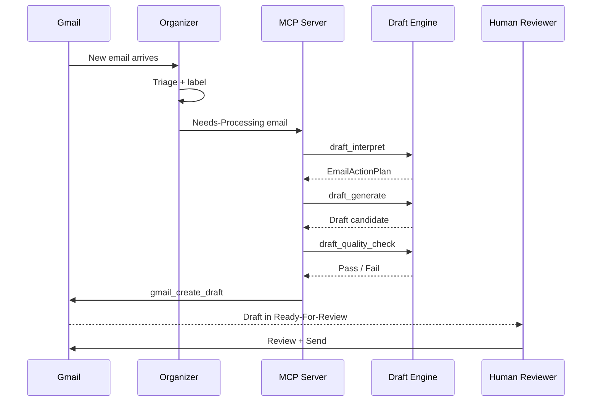
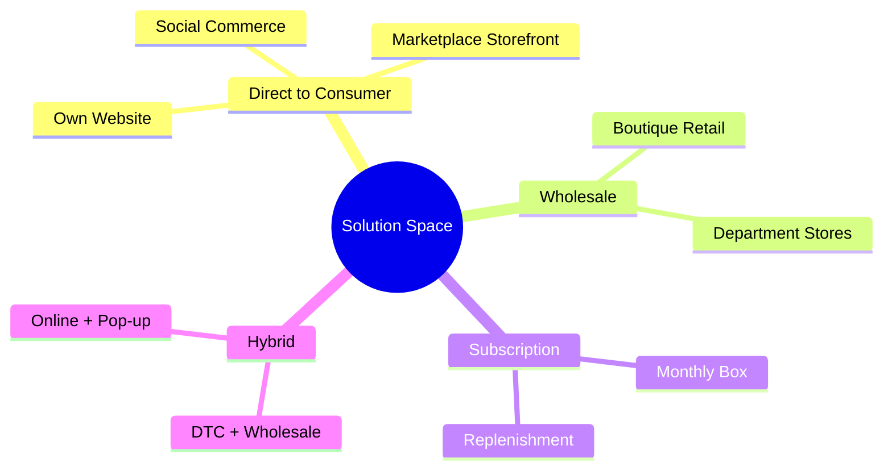

# Mermaid Diagram Types

Agent-facing reference for choosing and authoring Mermaid diagram types in this project.

## Summary Table

| Diagram Type | Use Case | Max Complexity | Key Constraint |
|---|---|---|---|
| `sequenceDiagram` | API call chains, message flows, multi-actor temporal interactions | 8 participants, 15 messages | Participant aliases must be declared upfront |
| `stateDiagram-v2` | Simple state machines, stage transitions | 12 states | State names must be alphanumeric — no colons, slashes, or punctuation |
| `flowchart` (as state machine) | State machines with complex labels | 20 nodes | Use stadium nodes `(["..."])` for state-like appearance |
| `mindmap` | Strategy brainstorming, option trees, feature decomposition | 3 levels deep, 7 branches/node | Indentation-based syntax, no edge labels |
| `flowchart` + ELK | Large dependency graphs, deep nesting | 120+ nodes | Requires separate CDN import + registration |

---

## 1. sequenceDiagram

### When to Use

- API call chains between services
- Email pipeline message flows (e.g., Gmail to MCP Server to Draft to Human)
- Multi-actor temporal interactions where **ordering matters**
- Request/response patterns with async callbacks

### Example: Email Pipeline Flow



### Quality Rules

- **Max 8 participants** per diagram. Split into multiple diagrams if more actors are involved.
- **Max 15 messages** per diagram. Beyond that, the diagram becomes unreadable.
- Always declare participants with aliases at the top — this controls left-to-right ordering.
- Use `-->>` (dashed arrow) for responses/returns, `->>` (solid) for requests/calls.

### Gotchas

**Participant aliases must be declared before use:**
```
participant G as Gmail       %% correct — alias G, display "Gmail"
```
If you skip the declaration, Mermaid uses the raw name and ordering becomes unpredictable.

**Note syntax uses `over`, `left of`, or `right of`:**
```
Note over M,D: Pipeline stages 1-8
Note right of H: Human-in-the-loop gate
```

**Activation bars** show when an actor is "busy". Use `activate`/`deactivate` or the shorthand `+`/`-`:
```
M->>+D: draft_generate
D-->>-M: Draft candidate
```
Keep activation bars short — deeply nested activations are hard to read.

**Escape `&` as `&amp;`** inside `<pre class="mermaid">` blocks (HTML entity parsing runs first).

---

## 2. stateDiagram-v2

### When to Use

- Startup-loop stage transitions (S0, S1, S2, ... S10)
- Simple state machines where **state names are single words or short alphanumeric labels**
- Lifecycle models with fork/join or choice nodes

### When NOT to Use

- Labels containing colons, slashes, or multi-word paths (e.g., `Queue/Needs-Processing`)
- Complex display text with punctuation or line breaks
- Anything where node labels need formatting beyond plain text

**For complex labels, use `flowchart` with stadium nodes instead.** See the counter-example below.

### Counter-Example: Email Label State Machine

The email label state machine in `docs/guides/brikette-email-system.html` (Diagram C) uses labels like `Queue / Needs-Processing`, `Outcome / Drafted`, and `Drafts / Ready-For-Review`. These break in `stateDiagram-v2` because the parser chokes on slashes and multi-word text inside state identifiers.

That diagram is correctly implemented as `flowchart LR` with stadium-shaped nodes — **this is the reference pattern for any state-like diagram with punctuated labels.**

### Example: Startup-Loop Stage Machine

```mermaid
stateDiagram-v2
    [*] --> S0: intake
    S0 --> S1: assessed
    S1 --> S2: baselined
    S2 --> S3: first hypotheses
    S3 --> S4: experiments live
    S4 --> S5: early signal
    S5 --> S6: pattern found
    S6 --> S7: unit economics
    S7 --> S8: repeatable
    S8 --> S9: scaling
    S9 --> S10: mature

    S3 --> Kill: no viable path
    S5 --> Kill: signal negative
    S7 --> Kill: economics fail

    S8 --> Scale: proven model
    S9 --> Scale: accelerate
    S10 --> Scale: full throttle

    Kill --> [*]
    Scale --> [*]
```

### Quality Rules

- **Use for simple state names only** — alphanumeric identifiers like `S0`, `Active`, `Pending`.
- **Prefer `flowchart` with stadium nodes** for anything containing punctuation, slashes, colons, or multi-word paths.
- Max ~12 states before the diagram becomes cluttered.
- Use `[*]` for start and end pseudo-states.

### Gotchas

**Colons in labels are treated as state descriptions, not literal text:**
```
S0: intake        %% "intake" becomes the description of state S0
```
This is fine for short descriptions but breaks if the text itself contains colons.

**Nested states** use indentation inside a state block:
```
state S2 {
    [*] --> Collecting
    Collecting --> Analyzing
    Analyzing --> [*]
}
```
Keep nesting to 1 level deep — deeper nesting renders poorly.

---

## 3. mindmap

### When to Use

- Strategy brainstorming and option exploration
- Feature decomposition trees
- Solution space scanning (e.g., business model exploration)
- Taxonomy or categorization visualization

### Example: Solution Space Exploration



### Quality Rules

- **Max 3 levels deep** (root + 2 child levels). Deeper trees become illegible.
- **Max 7 branches per node.** Beyond 7, split into multiple mindmaps or use a different diagram type.
- Use for divergent exploration — not for sequential processes (use flowchart) or temporal interactions (use sequenceDiagram).

### Gotchas

**Indentation-based syntax** — the tree structure is determined entirely by whitespace indentation. Mixing tabs and spaces will break the layout.

**No edge labels** — mindmap does not support text on the connecting lines. If you need labeled relationships, use a flowchart instead.

**Limited styling** — mindmap supports `::icon()` for icons on nodes but does not support `classDef` or per-node fill/stroke customization. Use the theme-level colors from `mermaid.initialize()`.

**Root node shape** uses double parentheses for a rounded shape:
```
root((My Topic))       %% rounded/pill shape
root[My Topic]         %% square shape
root)My Topic(         %% bang shape
```

---

## 4. ELK Layout Engine

### When to Use

- Diagrams with **>20 nodes** where the default dagre layout produces poor results
- Graphs with **>3 nested subgraphs** that overlap or misalign
- Dense dependency graphs (e.g., `docs/dependency-graph.md` with ~120 nodes)

### When NOT to Use

- Small diagrams (<20 nodes) — dagre handles these well and ELK adds unnecessary load time
- Only use when dagre produces **visibly poor results**: overlapping edges, unnecessary crossings, misaligned subgraphs

### CDN Import

```
https://cdn.jsdelivr.net/npm/@mermaid-js/layout-elk@0/dist/mermaid-layout-elk.esm.min.mjs
```

### How to Register

ELK must be loaded and registered **before** `mermaid.initialize()`:

```html
<script type="module">
  import mermaid from 'https://cdn.jsdelivr.net/npm/mermaid@11/dist/mermaid.esm.min.mjs';

  // Conditionally load ELK if any diagram uses it
  const hasElk = Array.from(document.querySelectorAll('.mermaid'))
    .some(el => el.textContent?.includes('defaultRenderer'));
  if (hasElk) {
    const { default: elkLayouts } = await import(
      'https://cdn.jsdelivr.net/npm/@mermaid-js/layout-elk@0/dist/mermaid-layout-elk.esm.min.mjs'
    );
    mermaid.registerLayoutLoaders(elkLayouts);
  }

  mermaid.initialize({ /* ... config ... */ });
</script>
```

See `references/mermaid-init.md` for the full initialization pattern with conditional ELK loading.

### How Diagrams Opt In

Add the ELK directive as the **first line** of the diagram:

```
%%{ init: { 'flowchart': { 'defaultRenderer': 'elk' } } }%%
flowchart TD
    A --> B
    B --> C
    ...
```

Only diagrams with this directive use ELK. All other diagrams on the same page continue to use the default dagre renderer.

### Quality Rules

- **Only use when dagre produces visibly poor results.** ELK adds a ~200KB CDN load and longer render time.
- The conditional loader pattern (checking for `defaultRenderer` in diagram text) ensures ELK is only fetched when at least one diagram on the page requests it.
- Test both dagre and ELK for borderline cases (15-25 nodes) — dagre sometimes produces cleaner output for medium-sized graphs.

---

## 5. Hand-Drawn Style

### When to Use

- Draft or WIP documents where a polished appearance would be misleading
- Brainstorming sessions and early-stage architecture sketches
- Internal working documents that are not shared externally

### When NOT to Use

- **NEVER use for published or final documentation.** Hand-drawn style signals "this is a draft" and undermines confidence in finished work.

### Configuration

Set `look: 'handDrawn'` in `mermaid.initialize()`:

```js
mermaid.initialize({
  startOnLoad: true,
  theme: 'base',
  look: 'handDrawn',
  themeVariables: {
    // ... same palette variables as usual ...
  }
});
```

The hand-drawn style applies to **all** diagram types on the page — you cannot mix hand-drawn and classic diagrams in the same HTML document (they share a single `mermaid.initialize()` call).

### Quality Rules

- Use hand-drawn style for the **entire document**, not selectively. The visual inconsistency of mixing styles is worse than committing to one.
- All other quality rules (max nodes, quoting labels, classDef conventions) still apply — hand-drawn style changes rendering, not syntax.
- Hand-drawn mode works with all diagram types: flowchart, sequenceDiagram, stateDiagram-v2, mindmap, etc.

---

## General Quality Rules (All Diagram Types)

These rules from `SKILL.md` apply universally:

1. **Quote all labels with special chars** — parentheses, colons, slashes, ampersands go inside `["..."]` or `("...")`. Unquoted special chars cause silent parse failures.
2. **Never set `color:` in `classDef`** — use `fill:` with 8-digit hex (last 2 digits = opacity). See `references/mermaid-init.md` for the classDef conventions.
3. **CSS overrides for text color are mandatory** — add `.mermaid .nodeLabel { color: var(--text) !important; }` so text respects the page's color scheme.
4. **Max ~20 nodes per diagram** (unless using ELK for larger graphs). Split complex flows rather than crowding.
5. **Arrow semantics**: `-->` primary flow, `-.->` async/recovery/optional, `==>` critical/highlighted path, `--x` blocked/rejected.
6. **Escape `&` as `&amp;`** inside `<pre class="mermaid">` blocks.
7. **Never use `\n` in node labels** — use a real line break inside the quoted label instead.
