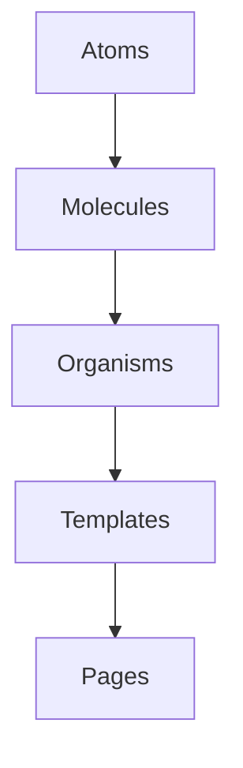

# Architecture

This project organizes UI code according to a simple five‑layer model loosely based on Atomic Design. Each layer may depend only on layers below it. Higher layers should never be imported by lower layers.

## Layers

1. **Atoms** – small, reusable primitives such as `Button` or `Input`. Atoms do not import components from any other layer.
2. **Molecules** – compositions of two or more atoms (for example a `SearchForm` built from `Input` and `Button`). Molecules may import atoms only.
3. **Organisms** – more complex sections of the interface like `ProductCard` or `Header`. They may import molecules and atoms.
4. **Templates** – page‑level layouts that assemble organisms to provide structure but contain little real content. They may import organisms, molecules and atoms.
5. **Pages** – Next.js route components that fetch data and render templates. Pages sit at the top of the hierarchy and should not be imported elsewhere.

The directory structure under `packages/ui/components` mirrors the first four layers:

```
packages/ui/components/
  atoms/
  molecules/
  organisms/
  templates/
```

Pages live inside each application’s `src/app/` directory.

## Allowed import flow

Imports must always follow the direction of the arrows in the diagram below:



Atoms have no internal dependencies. Molecules may depend on atoms; organisms may depend on molecules and atoms; templates may depend on organisms, molecules and atoms; and pages may depend on any UI layer. Keeping this order prevents cyclical dependencies and helps maintain separation of concerns.
