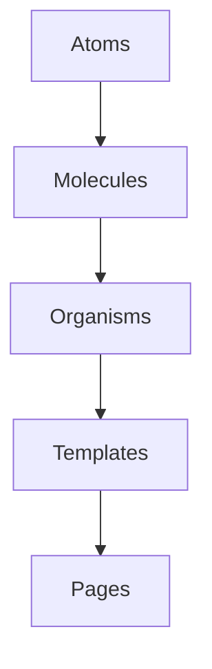
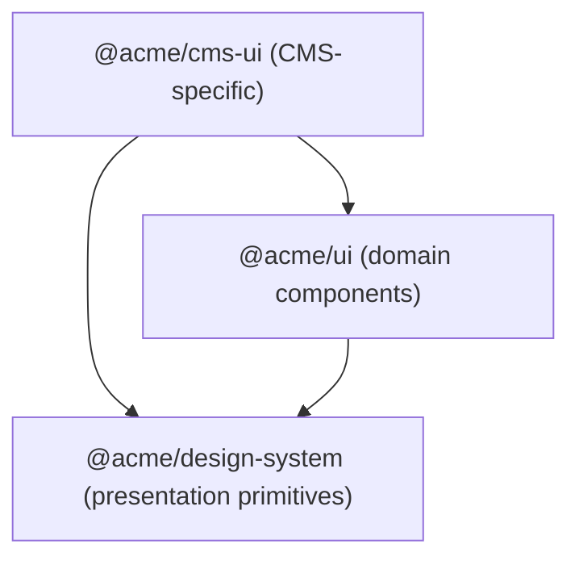

Type: Contract
Status: Canonical
Domain: Platform
Last-reviewed: 2025-12-02

Canonical code:
- apps/**
- packages/**

# Architecture

For testing guidance, see [testing](../__tests__/docs/testing.md).

This project organizes UI code according to a simple five‑layer model loosely based on Atomic Design. Each layer may depend only on layers below it. Higher layers should never be imported by lower layers.

## Layers

1. **Atoms** – small, reusable primitives such as `Button` or `Input`. Atoms do not import components from any other layer.
2. **Molecules** – compositions of two or more atoms (for example a `SearchForm` built from `Input` and `Button`). Molecules may import atoms only.
3. **Organisms** – more complex sections of the interface like `ProductCard` or `Header`. They may import molecules and atoms.
4. **Templates** – page‑level layouts that assemble organisms to provide structure but contain little real content. They may import organisms, molecules and atoms.
5. **Pages** – Next.js route components that fetch data and render templates. Pages sit at the top of the hierarchy and should not be imported elsewhere.

The directory structure under `packages/ui/components` mirrors the first four layers:

```
packages/ui/components/
  atoms/
  molecules/
  organisms/
  templates/
```

Pages live inside each application’s `src/app/` directory.

## UI primitives

The `packages/ui/components/atoms/primitives` folder contains generic wrappers around
HTML elements and Radix primitives. These files are intentionally small
and stateless. They provide the lowest‑level building blocks that other
layers build upon. Avoid placing full atoms or molecules in this folder;
instead create a generic primitive here and extend it inside the
appropriate `atoms` or `molecules` directory.

### shadcn/ui integration

A curated set of primitives from [shadcn/ui](https://ui.shadcn.com/) is
available under `packages/ui/components/atoms/shadcn`. These wrappers
behave like our own atoms but retain the default shadcn look and feel.
Importing from `atoms/shadcn` makes it explicit that the element comes
from the external library. All shadcn primitives are surfaced via this
entrypoint so they can be used from molecules, organisms, templates and
pages just like our in‑house atoms:

```ts
import { Button } from "@/components/atoms/shadcn";
```

All other atoms in `packages/ui/components/atoms` are developed in
house. The `atoms/shadcn` index currently exposes wrappers for
`Button`, `Input`, `Card`, `Checkbox`, `Dialog`, `Select`, `Table` and
`Textarea`.

### Naming conventions

The component names exported from `atoms/shadcn` mirror their shadcn/ui
counterparts. When using a shadcn wrapper alongside an in‑house atom of
the same name, alias the import to keep the origin obvious:

```ts
import { Button } from "@/components/atoms";
import { Button as ShButton } from "@/components/atoms/shadcn";
```

This avoids confusion for new contributors while keeping the API
surface close to upstream shadcn/ui.

### Keeping shadcn wrappers in sync

A helper script checks our wrappers against the upstream package.
Run it after updating `@shadcn/ui`:

```bash
pnpm shadcn:diff
```

## Allowed import flow

Imports must always follow the direction of the arrows in the diagram below:



Atoms have no internal dependencies. Molecules may depend on atoms; organisms may depend on molecules and atoms; templates may depend on organisms, molecules and atoms; and pages may depend on any UI layer. Keeping this order prevents cyclical dependencies and helps maintain separation of concerns.

## Database

Data is stored in PostgreSQL through [Prisma](https://www.prisma.io/).
The schema (see `packages/platform-core/prisma/schema.prisma`) defines:

- `Shop` – JSON shop configuration and related `Page` records.
- `Page` – per-shop pages tied to a `Shop`.
- `RentalOrder` – rental transactions with unique `(shop, sessionId)`
  and `(shop, trackingNumber)` plus an index on `customerId`. See
  [orders.md](orders.md).
- `SubscriptionUsage` – monthly shipment counts with a unique
  `(shop, customerId, month)` tuple. See
  [subscription-usage.md](subscription-usage.md).
- [`CustomerProfile`](customer-profiles.md) – stores customer metadata
  and preferences keyed by `customerId`.
- [`CustomerMfa`](mfa.md) – holds multi-factor authentication secrets
  for each customer.
- [`User`](users.md) – application user accounts identified by unique
  email addresses.
- [`ReverseLogisticsEvent`](reverse-logistics-events.md) – logs
  return-processing milestones for rental items per shop.

The connection string is provided via the `DATABASE_URL` environment
variable.

## Package layering and public surfaces

Beyond UI atoms → templates, the CMS and shop runtime follow a package‑level layering model. Higher layers may depend on lower layers, but never the reverse:

- `@acme/platform-core` – owns domain logic and persistence for shops, pages, cart/checkout, orders, pricing, tax and settings. It may depend on low‑level libraries (`@acme/types`, `@acme/zod-utils`, `@acme/shared-utils`, `@acme/date-utils`, design tokens, telemetry, etc.) but must not import from `@acme/ui`, CMS‑only packages, or any app.
- `@acme/ui` – design system and CMS/editor UI toolkit. It may depend on platform‑core types and light helpers and on the same low‑level libraries, but must not depend on apps or on app‑specific persistence.
- CMS‑only packages (for example `@acme/cms-marketing`, `@acme/configurator`) – sit above `platform-core`/`ui` and below the CMS app. They orchestrate CMS flows, dashboards and configurator UIs by depending on `platform-core` for domain operations and `ui` for layout and Page Builder/editor primitives. They must not contain runtime storefront routes or direct database access.
- Page Builder packages – `@acme/page-builder-core` holds pure PB state and transforms (no React, no I/O). `@acme/page-builder-ui` builds PB React UI on top of `page-builder-core` and `@acme/ui`. `@acme/templates` holds reusable templates and block implementations that compose `ui` and PB primitives.
- Apps – `packages/template-app` and tenant apps under `apps/*` are thin shells that compose `platform-core`, `ui`, Page Builder and CMS‑only packages. They provide routing, branding and app‑specific glue, but other packages must never depend on apps.

Shared packages expose a deliberately small public surface:

- Public APIs live in the package `exports` map (see `package.json`) and are implemented via `src/index.ts` and, where useful, `src/public/**`. New call sites should import from these entrypoints only.
- Internal details live under `src/internal/**` and other deep paths in `src/**`. These files are free to change and must not be imported from apps or other packages unless explicitly documented.
- Apps and feature packages must never import from `@acme/*/src/**`. Instead, they should use `@acme/<package>` or documented subpaths such as `@acme/platform-core/cart` or `@acme/ui` components as exported in each package’s `exports`.

When adding new capabilities, decide first which layer owns the behaviour (domain in `platform-core`, UI in `ui`, CMS glue in `cms-marketing`/configurator, PB logic in the PB packages, or app‑specific glue in apps). Then add or extend a public API at that layer and consume it from higher layers instead of reaching into internal modules.

## UI Package Architecture

The UI packages follow a three-tier layering model:



### `@acme/design-system` (foundation / presentation layer)

The canonical source for presentation-only components with no domain logic:
- **Primitives**: `@acme/design-system/primitives` (Button, Card, Input, etc.)
- **Atoms**: `@acme/design-system/atoms` (Alert, Avatar, Chip, etc.)
- **Molecules**: `@acme/design-system/molecules` (Breadcrumbs, SearchBar, etc.)
- **Shadcn wrappers**: `@acme/design-system/shadcn` (shadcn/ui components)
- **Presentation hooks**: `@acme/design-system/hooks` (useViewport, useReducedMotion)
- **Style utilities**: `@acme/design-system/utils/style` (cn, cssVars, boxProps)

This package **must not** import from `@acme/ui` or `@acme/cms-ui`.

### `@acme/ui` (domain layer)

Contains domain-specific components and compatibility shims:
- Domain components (checkout flows, product displays, etc.)
- Domain hooks and contexts (cart, pricing, rates)
- Page Builder components (`@acme/ui/components/cms/page-builder/*`)
- Compatibility shims that delegate to `@acme/design-system`

This package **must not** import from `@acme/cms-ui`.

### `@acme/cms-ui` (CMS/editor layer)

CMS-specific editor components and page builder UI:
- Block editors and section components
- Page builder panels and toolbars
- Style token editors

This package may import from both `@acme/ui` and `@acme/design-system`.

### Import Guidelines

**Prefer design-system for presentation primitives:**
```ts
// ✅ Good - canonical imports
import { Button } from "@acme/design-system/primitives";
import { cn } from "@acme/design-system/utils/style";
import { useViewport } from "@acme/design-system/hooks";

// ⚠️ Deprecated - will trigger ESLint warnings
import { Button } from "@acme/ui/atoms";
import { cn } from "@acme/ui/utils/style";
```

**Use @acme/ui for domain components:**
```ts
import { CheckoutForm } from "@acme/ui/components/checkout/CheckoutForm";
import { ProductCard } from "@acme/ui/components/organisms/ProductCard";
```

For the full migration plan, see [docs/plans/ui-architecture-consolidation-plan.md](plans/ui-architecture-consolidation-plan.md).
