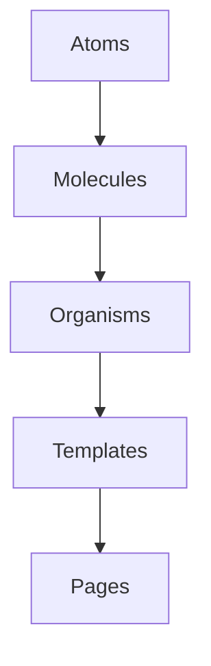

# Architecture

For testing guidance, see [testing](../__tests__/docs/testing.md).

This project organizes UI code according to a simple five‑layer model loosely based on Atomic Design. Each layer may depend only on layers below it. Higher layers should never be imported by lower layers.

## Layers

1. **Atoms** – small, reusable primitives such as `Button` or `Input`. Atoms do not import components from any other layer.
2. **Molecules** – compositions of two or more atoms (for example a `SearchForm` built from `Input` and `Button`). Molecules may import atoms only.
3. **Organisms** – more complex sections of the interface like `ProductCard` or `Header`. They may import molecules and atoms.
4. **Templates** – page‑level layouts that assemble organisms to provide structure but contain little real content. They may import organisms, molecules and atoms.
5. **Pages** – Next.js route components that fetch data and render templates. Pages sit at the top of the hierarchy and should not be imported elsewhere.

The directory structure under `packages/ui/components` mirrors the first four layers:

```
packages/ui/components/
  atoms/
  molecules/
  organisms/
  templates/
```

Pages live inside each application’s `src/app/` directory.

## UI primitives

The `packages/ui/components/atoms/primitives` folder contains generic wrappers around
HTML elements and Radix primitives. These files are intentionally small
and stateless. They provide the lowest‑level building blocks that other
layers build upon. Avoid placing full atoms or molecules in this folder;
instead create a generic primitive here and extend it inside the
appropriate `atoms` or `molecules` directory.

### shadcn/ui integration

A curated set of primitives from [shadcn/ui](https://ui.shadcn.com/) is
available under `packages/ui/components/atoms/shadcn`. These wrappers
behave like our own atoms but retain the default shadcn look and feel.
Importing from `atoms/shadcn` makes it explicit that the element comes
from the external library. All shadcn primitives are surfaced via this
entrypoint so they can be used from molecules, organisms, templates and
pages just like our in‑house atoms:

```ts
import { Button } from "@/components/atoms/shadcn";
```

All other atoms in `packages/ui/components/atoms` are developed in
house. The `atoms/shadcn` index currently exposes wrappers for
`Button`, `Input`, `Card`, `Checkbox`, `Dialog`, `Select`, `Table` and
`Textarea`.

### Naming conventions

The component names exported from `atoms/shadcn` mirror their shadcn/ui
counterparts. When using a shadcn wrapper alongside an in‑house atom of
the same name, alias the import to keep the origin obvious:

```ts
import { Button } from "@/components/atoms";
import { Button as ShButton } from "@/components/atoms/shadcn";
```

This avoids confusion for new contributors while keeping the API
surface close to upstream shadcn/ui.

### Keeping shadcn wrappers in sync

A helper script checks our wrappers against the upstream package.
Run it after updating `@shadcn/ui`:

```bash
pnpm shadcn:diff
```

## Allowed import flow

Imports must always follow the direction of the arrows in the diagram below:



Atoms have no internal dependencies. Molecules may depend on atoms; organisms may depend on molecules and atoms; templates may depend on organisms, molecules and atoms; and pages may depend on any UI layer. Keeping this order prevents cyclical dependencies and helps maintain separation of concerns.

## Database

Data is stored in PostgreSQL through [Prisma](https://www.prisma.io/).
The schema (see `packages/platform-core/prisma/schema.prisma`) defines:

- `Shop` – JSON shop configuration and related `Page` records.
- `Page` – per-shop pages tied to a `Shop`.
- `RentalOrder` – rental transactions with unique `(shop, sessionId)`
  and `(shop, trackingNumber)` plus an index on `customerId`. See
  [orders.md](orders.md).
- `SubscriptionUsage` – monthly shipment counts with a unique
  `(shop, customerId, month)` tuple. See
  [subscription-usage.md](subscription-usage.md).
- [`CustomerProfile`](customer-profiles.md) – stores customer metadata
  and preferences keyed by `customerId`.
- [`CustomerMfa`](mfa.md) – holds multi-factor authentication secrets
  for each customer.
- [`User`](users.md) – application user accounts identified by unique
  email addresses.
- [`ReverseLogisticsEvent`](reverse-logistics-events.md) – logs
  return-processing milestones for rental items per shop.

The connection string is provided via the `DATABASE_URL` environment
variable.
