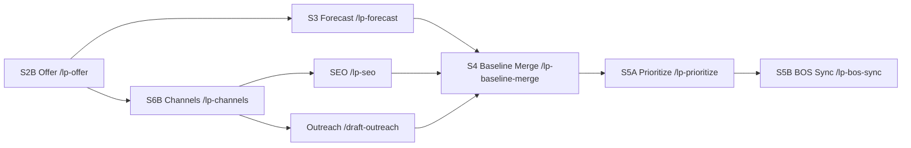

# Startup Loop: Current System vs Proposed Upgrade (Standalone Briefing)

## 1) Purpose of This Document

This document explains, in plain language:

1. What the Startup Loop system does today.
2. Where it is currently fragile.
3. What is being proposed to fix it.
4. What will change for operators and reviewers.

This is written so a reader can assess the system without needing access to any internal repository.
`BOS` means `Business Operating System` (the system of record for ideas/cards/stage docs).

## 2) Audience Scope and Reading Path

Primary audience:

1. External reviewers assessing architecture soundness, autonomy safety, and scalability.

Secondary audience:

1. Internal implementers using the appendices for concrete contract shapes.

Recommended reading path:

1. Read Sections `1` to `15` for decision-grade review.
2. Use Sections `16` to `18` only if you need implementation-oriented contract examples and disposition history.

## 3) Executive Summary

The system already has strong capability coverage. It can:

1. Intake business ideas.
2. Run readiness checks.
3. Bring in market research.
4. Build forecasts.
5. Prioritize execution items.
6. Route items into fact-find -> plan -> build.
7. Run launch QA and weekly experiments.

The main weakness is contract drift, not missing capability. In practical terms, different parts of the system disagree on:

1. Stage names and stage order.
2. Input/output file locations.
3. Fact-find/plan/build handoff naming.
4. Which step is responsible for writing to the business system of record.

The proposal is to treat the loop like a versioned API:

1. One canonical loop specification.
2. One artifact manifest per business.
3. One canonical workspace for feature delivery artifacts.
4. Explicit split between reasoning steps and persistence steps.
5. Explicit fan-out/fan-in barriers for safe parallel execution.
6. Automated contract lint checks so drift is caught in CI, not by manual audits.

## 4) Decisions Required to Proceed

These are explicit closure points. The proposal should not move to build until each item has an owner and decision date.

| Decision area | Decision to make | Recommended direction |
|---|---|---|
| Canonical stage set | Confirm final stage list, including `S2B`, `S6B`, `S9B`, and whether `S4` is a stage or only a barrier | Keep `S2B/S6B/S9B`; define `S4` as a first-class stage that also acts as a join barrier |
| Canonical artifact roots | Confirm exact allowed directory classes for baseline artifacts and feature workspaces | Baseline: one canonical `<baseline_root>`; feature delivery: one canonical `<feature_workspace_root>/<feature_id>/` |
| Canonical stage-doc keys | Confirm final key names and legacy alias policy | Use canonical keys and time-box alias support with a clear sunset date |
| S10 primitive | Confirm whether to unify on one route or keep multiple launch routes | Unify on `/lp-experiment`; treat launch as a state transition inside derived run-state |
| Migration window | Confirm compatibility window length and exit criteria | Set a defined migration period plus hard exit checks before removing legacy paths |
| Locking model | Confirm whether shared-output writer locks are mandatory, including TTL and recovery rules | Prefer lock-free single-writer updates; use TTL lock only as exceptional recovery/fallback mechanism |
| Run concurrency policy | Confirm whether multiple concurrent runs per business are allowed | Start with one active run per business (queue additional runs), then relax only after explicit health criteria are met |
| Baseline semantics | Confirm run-level baseline vs business-level current baseline and commit point | Keep run baseline immutable; update business-current baseline only at explicit commit stage (`S4` or `S5B`) |

## 5) What the Current System Is Trying to Do

### Core objective

Take a business from idea and constraints to repeatable execution decisions, while continuously learning from outcomes.

### Current high-level loop

1. Intake: capture business idea, product direction, constraints.
2. Readiness: check whether enough context exists to proceed.
3. Research: gather market and channel intelligence.
4. Forecasting: model expected outcomes and guardrails.
5. Prioritization: select the best next go-items.
6. Delivery chain: fact-find -> plan -> build.
7. QA and measurement: validate before launch.
8. Weekly decision loop: Keep, Pivot, Scale, or Kill.

### Current strengths

1. Broad skill coverage across strategy, delivery, quality, and measurement.
2. Good operator-facing workflow documentation.
3. Clear intent to support both startup and existing-business paths.
4. Strong emphasis on evidence and documented outputs.
5. Parallelization potential already identified in key branches.

## 6) Where the Current System Breaks Down

These are reliability issues, not idea-quality issues.

### Contract drift (three truths problem)

Today, the system has three separate sources of truth:

1. Human workflow guide.
2. Orchestration wrapper.
3. Individual skill contracts.

When these drift, the operator sees one sequence while automation executes another.

### Stage graph mismatch

Some stages exist in automation but are not consistently modeled in the human workflow and prompt index. This causes ambiguity in:

1. What is “current stage”.
2. What must be completed before advancing.
3. Which outputs are mandatory.

### Artifact path mismatch

Different skills currently expect different artifact shapes (flat naming vs nested stage folders). This causes consumer skills to miss producer outputs.

### Handoff naming mismatch

Fact-find to plan/build handoff uses inconsistent naming conventions, which breaks fast-path automation and requires manual intervention.

### Reasoning vs persistence mixed contracts

A prioritization step is expected (in workflow) to also persist cards/items to the system of record, while the skill itself defines no side effects. This is a clean architecture split that has not yet been formalized.

### Launch primitive ambiguity

The loop references two different end-of-build transitions for post-build progression, causing uncertainty in what “ready to launch” actually means.

### Parallelization without explicit join contracts

Parallel branches are identified, but some merges are still implied rather than explicitly enforced by a merge barrier contract.

## 7) Proposed System (What Changes)

### Design principles

1. Single source of truth for stage contracts.
2. Artifact resolution by manifest, not hardcoded file guesses.
3. Deterministic fan-out/fan-in for parallel work.
4. Single-writer control plane for shared state updates.
5. Clear separation of pure reasoning and side effects.
6. Backward compatibility during migration.
7. CI guardrails to prevent future drift.
8. Controlled velocity: explicit breakage containment plus stabilization triggers.

### Proposed architecture changes

#### Change A: Canonical Loop Spec

Introduce one machine-readable loop contract (`versioned`) that defines:

1. Stages and ordering.
2. Gate rules.
3. Allowed parallel branches.
4. Required artifacts in/out.
5. Join points.

All human docs and orchestration routes must match this spec.
The orchestrator must consume this spec at runtime (or generate its routing table from it), not just reference it in documentation.
Each run should record the exact loop spec version used.

#### Change B: Baseline Manifest + Resolver

For each business, maintain one manifest that points to canonical artifacts by logical key (for example `offer`, `channels`, `forecast`, `loop_state`).

Consumer steps must resolve artifacts through the manifest first, with legacy fallback allowed during migration.
Parallel workers should not update the manifest directly. They write only stage-owned outputs; a single writer (or merge stage) updates the manifest after validation.
Manifest entries should include minimal integrity metadata (for example timestamp + fingerprint/hash) to reduce stale-pointer risk.

#### Change C: Feature Workspace Standard

Replace filename-convention handoffs with one canonical per-feature workspace:

1. Fact-find artifact.
2. Plan artifact.
3. Sequence/parallelism artifact.
4. Build log artifact.
5. QA artifact.

This eliminates naming ambiguity and keeps all feature lifecycle artifacts together.

#### Change D: Split S5 into Reasoning and Persistence

Formalize two separate responsibilities:

1. Prioritize (pure ranking, no writes).
2. BOS sync (create/update cards and stage docs in the system of record).

This removes contract contradiction and makes prioritization reusable in dry-run mode.
Prioritize can run in dry-run mode on any baseline snapshot; BOS sync is the sole step allowed to mutate the system of record.

#### Change E: Canonical Stage-Doc Keys + Aliases

Use canonical keys for stage docs (fact-find, plan, build, QA, experiment) and keep a temporary alias map for legacy names during migration.

#### Change F: Run-state convergence primitive

Define one run-state ledger per business that records:

1. Active stage.
2. Stage status (`NotStarted`, `Active`, `Done`, `Blocked`).
3. Blocking reasons.
4. Artifact pointers.
5. Writer-lock metadata for shared outputs.

Preferred model for scale:

1. Append-only run events (`events.jsonl`) as source of truth.
2. Derived run state (`state.json`) generated from events.
3. Single writer updates derived shared state pointers.

This becomes the gating input for launch QA and post-build progression.

#### Change F2: Baseline Commit Semantics

To avoid partial-strategy contamination:

1. Run-level baseline is immutable and scoped to the run.
2. Business-level “current baseline” is a controlled pointer.
3. Only explicit commit stages (`S4` or `S5B`, per final decision) can update that business-level pointer.

#### Change G: S10 primitive unification

Pick one canonical post-build continuation route for weekly experimentation and remove unresolved alternate paths.

#### Change H: Contract lint in CI

Add automated checks for:

1. Stage graph mismatch.
2. Missing/stale skill references.
3. Non-canonical artifact root usage.
4. Legacy names reintroduced by mistake.

Minimum rule set for “contract lint”:

1. Wrapper stage graph matches loop spec.
2. Prompt index covers loop-spec stages, or explicitly marks `no-prompt-required`.
3. Every referenced skill exists.
4. Skills write only under canonical artifact roots.
5. Produced artifacts are registered in the business baseline manifest.
6. Legacy naming fails lint after sunset date.

#### Change I: Explicit Baseline Merge Barrier

Make baseline merge a first-class stage (`S4`) that joins parallel branch outputs deterministically before prioritization and writes a canonical baseline snapshot.

#### Change J: Autonomy Policy + Blast Radius Controls

Add explicit execution policy modes so autonomy can be high without uncontrolled side effects:

1. Autonomous actions (safe by default).
2. Guarded actions (require stricter checks or explicit approval mode).
3. Prohibited actions (unless explicit override path is used).

This keeps speed high while containing failure impact.

Minimum classification examples:

| Policy mode | Example actions |
|---|---|
| Autonomous | Generate stage artifacts, write stage result files, run analysis/lint/planning tasks |
| Guarded | Update business-current baseline pointer, apply `bos-sync`, deploy or publish changes |
| Prohibited by default | Delete run history, destructive bulk mutations, irreversible data rewrites |

#### Change K: Observability for Autonomy Health

Track operational autonomy quality, not just output artifacts. Minimum metrics:

1. Manual intervention rate per run.
2. Replan loop frequency.
3. Join-block frequency and causes.
4. Time to reach S9B.
5. Contract-lint failure trend.

## 8) Current vs Proposed Comparison

| Area | Current | Proposed |
|---|---|---|
| Stage model | Defined in multiple places, can drift | One canonical loop spec, all views validated against it |
| Artifact lookup | Skill-specific hardcoded paths | Manifest-driven resolution with legacy fallback |
| Fact-find -> plan -> build handoff | File naming conventions, inconsistent | Canonical per-feature workspace |
| Prioritization and BOS writes | Mixed expectations, conflicting contracts | Explicit split: prioritize vs bos-sync |
| Stage-doc naming | Inconsistent keys in some contracts | Canonical keys + alias bridge |
| Shared state ownership | Multiple skills may contend on shared pointers | Single-writer control plane for manifest + run state |
| Parallel execution | Identified but partially informal | Explicit fan-out/fan-in with merge barrier |
| Launch progression | Ambiguous primitive in parts of system | Unified post-build route |
| Drift detection | Manual audit required | CI lint checks catch contract regressions |
| Autonomy risk control | Implicit and inconsistent | Explicit autonomy policy + blast-radius controls |
| Autonomy observability | Not explicitly tracked | Manual-intervention and stability metrics tracked per run |

## 9) Proposed Stage Flow (Conceptual)

### Normal path

1. S0 Intake.
2. S1 Readiness.
3. Conditional gate: run `S1B` only when launch surface is pre-website and measurement is missing/insufficient.
4. Conditional gate: run `S2A` only for website-live businesses with existing operating history.
5. S2 Market intelligence.
6. S2B Offer definition.
7. Fan-out:
   - S3 Forecast.
   - S6B Channels/SEO/Outreach.
8. S4 Baseline merge stage (`/lp-baseline-merge`): explicit join barrier that writes `baseline.snapshot` and updates the manifest.
9. S5A Prioritize.
10. S5B BOS sync.
11. S6 Site-upgrade synthesis (when in scope).
12. S7 Fact-find.
13. S8 Plan.
14. S9 Build.
15. S9B QA gates.
16. S10 Weekly experiment/readout loop.

### Existing-business path additions

For website-live businesses, S2 and downstream strategy are blocked until S2A historical baseline is active and decision-grade.
S1B and S2A are conditional gates, not mandatory paired steps. Some runs will execute only one of them.

## 10) Parallelization Model (Proposed)

### Safe parallel branches

1. Forecast and channels branch after offer.
2. SEO and outreach branch after channel strategy.
3. Multi-item fact-find branch for top-ranked items (after BOS IDs are stable).
4. Build waves through dependency sequencing.

### Required join barriers

1. Baseline merge must join forecast + channels outputs.
2. Prioritization must not run until baseline merge is complete.
3. Delivery chain must not fan out into multiple items until persistence mapping is complete.

### Canonical fan-out/join DAG



### Runtime Discipline (Non-Negotiables)

1. Parallel workers write only to stage-owned outputs.
2. Shared control artifacts (`manifest`, run-state pointers, stage transitions) are single-writer updates.
3. Join stages are mechanical and deterministic; they validate and compose, they do not silently reinterpret.
4. If required upstream artifacts are missing or invalid, join stages block with explicit reasons.

## 11) What This Means for External Reviewers

If you are reviewing this system without repository access, the key question is:

“Do the proposed contracts make this loop deterministic, auditable, and safe for parallel scale?”

You should specifically test whether the proposal:

1. Prevents stage ambiguity.
2. Prevents artifact lookup ambiguity.
3. Prevents side-effect confusion.
4. Prevents branch-merge confusion.
5. Detects regressions automatically.

### Acceptance Criteria (“Done Means”)

| Dimension | Acceptance test |
|---|---|
| Determinism | Given loop spec + baseline manifest, consumer stages resolve required inputs without manual path hints |
| Runtime authority | Orchestrator routes from loop spec (or generated artifact) and records `loop_spec_version` on every run |
| Auditability | Every stage has status + artifact pointers + blocking reason (if blocked) recorded in derived run-state |
| Parallel safety | Fan-out stages write disjoint outputs (or acquire lock) and join stages cannot complete until all required upstream artifacts exist |
| Shared-state safety | Manifest and run-state transitions are written by a single writer path only |
| Side-effect safety | `bos-sync` is idempotent and can be retried without duplicate state mutation |
| Regression resistance | CI fails when stage graphs diverge, skill refs are stale, non-canonical roots are used, or legacy names reappear after sunset |

## 12) Migration Approach (Recommended)

### Migration strategy

Use compatibility-first migration (no hard cutover):

1. Add canonical contracts first.
2. Read legacy + write canonical for a transition window.
3. Turn on lint checks.
4. Remove legacy support after stability window.

### Practical sequence

1. Introduce loop spec.
2. Introduce baseline manifest + resolver.
3. Enforce single-writer control path for manifest and run-state transitions.
4. Enforce initial run-concurrency policy (one active run per business).
5. Canonicalize feature workspace.
6. Split S5 into prioritize + bos-sync.
7. Canonicalize stage-doc keys + aliases.
8. Introduce run-events + derived run-state schema and gates.
9. Lock baseline commit semantics (run baseline vs business-current baseline pointer).
10. Unify S10 primitive.
11. Add CI contract lint.
12. Add explicit baseline merge step.

### Why this order

The sequence is dependency-first, not preference-first:

1. Spec before orchestration: without a runtime-authoritative spec, later controls can drift immediately.
2. Resolver and single-writer before broad parallelism: path and state safety must exist before fan-out.
3. Workspace and S5 split before large-scale execution: this isolates reasoning from side effects and removes naming ambiguity.
4. Run events/derived state before strict gates: recovery and auditability need a reliable runtime ledger.
5. Lint after canonical contracts exist: lint should enforce known-good rules, not shifting drafts.
6. Baseline merge hardening before scale-up: deterministic joins are required before increasing concurrent throughput.

### Migration Window and Exit Criteria

Recommended migration window:

1. Time-boxed compatibility period (for example 2-4 weeks).
2. Legacy path reads allowed during this window only.
3. Canonical writes required from day 1 of migration.

Recommended exit criteria:

1. All active businesses have valid baseline manifests and derived run-state ledgers.
2. No unresolved legacy-path reads in recent runs.
3. Legacy alias reads are zero for N consecutive runs (example threshold: 10 runs).
4. Contract lint passes with legacy rules switched from warning to error.
5. Two full supervised runs complete without manual path intervention.

### Run failure and recovery semantics

Recovery model:

1. Resume by default: restart from last `Done` stage in derived run-state.
2. Restart only when control-plane integrity is compromised (for example missing/corrupt events chain).
3. Partial stage outputs are not treated as complete unless stage result file is `status: Done`.
4. Join stage re-checks all required upstream keys on resume; missing keys keep run `Blocked` with explicit reason.
5. `bos-sync` retries must be idempotent and safe; duplicate side effects are treated as severity-1 defects.

Operational handling:

1. Failed run remains auditable in run events and derived state.
2. Recovery action is recorded as explicit run event (`resume`, `restart`, `abort`).
3. No hidden cleanup of partial artifacts; cleanup, if needed, is an explicit controlled action.

### Run-concurrency relaxation criteria

Default mode:

1. One active run per business.

Relaxation gate (all required, assessed over rolling 20 runs):

1. Median manual interventions <= 1 per run.
2. Shared-state contention incidents = 0.
3. Join-stage state-race failures = 0.
4. Resume success rate >= 95%.
5. Contract-lint failure rate < 10% of merges.

### Operator Impact (Day-to-Day)

| Current operator friction | Operator experience after proposal |
|---|---|
| Operators hunt for the right filename/path | Operators resolve by manifest keys, not filename guessing |
| Blockers are scattered across docs | Stage status and blockers are visible in one derived run-state ledger |
| Side effects can occur in reasoning steps | BOS mutation is isolated to explicit `bos-sync` step |
| Parallel branches are hard to merge safely | Fan-out and join barriers are explicit and enforced |

### Breakage Ledger (Controlled Velocity)

Maintain a single breakage ledger for intentional shortcuts. Each entry should include:

1. What is knowingly broken (contract/path/naming/semantics).
2. Why it was accepted.
3. Blast radius.
4. Workaround.
5. Exit criterion.
6. Owner.

This converts “move fast and break things” into explicit and reviewable risk decisions.

### Stabilization Triggers

Pause expansion work and prioritize control-system hardening when threshold triggers are hit.
Initial thresholds (calibrate after first 20 production-like runs):

1. Manual interventions > 2 per run (rolling median over last 10 runs).
2. Same join-stage blocking root cause appears in >= 3 of last 10 runs.
3. Contract-lint failure rate > 10% over last 20 merges.
4. Replan-loop count median > 2 per run over last 10 runs.

### Process-Contract Error Budget

Treat process debt like an error budget. Define a small set of measurable limits for “acceptable controlled breakage” and force stabilization work when exceeded.

Suggested minimum signals:

1. Manual intervention rate per run.
2. Join-block recurrence rate by root cause.
3. Replan-loop count per run.
4. Contract-lint failure rate over recent merges.
5. Resume success rate.

Suggested operating rule:

1. Within budget: continue feature velocity.
2. Out of budget: pause expansion and pay down breakage-ledger/control-debt items until back in budget.

## 13) Risks and Tradeoffs

| Tradeoff | Benefit | Cost |
|---|---|---|
| More explicit contracts | Higher reliability, easier automation | More upfront documentation and migration work |
| Manifest + resolver layer | Path drift resistance, easier refactors | Added maintenance of manifest updates |
| Split reasoning and persistence | Cleaner architecture, safer dry-runs | One additional step/skill in sequence |
| Backward compatibility period | Lower rollout risk | Temporary dual-mode complexity |
| CI contract lint | Fast regression detection | Initial setup effort and occasional strictness |

### Risk Register (Failure Modes + Mitigations)

| Failure mode | Why it matters | Mitigation |
|---|---|---|
| Loop spec exists but is not runtime-authoritative | Stage drift returns despite documentation quality | Orchestrator reads spec (or generated routing from spec) and logs `loop_spec_version` per run |
| Stage output completes but shared pointers are not updated | Downstream stages fail to resolve inputs | Workers emit stage result files; single-writer orchestrator derives and updates manifest/state pointers |
| Multiple workers mutate shared control files | Merge conflicts and nondeterministic stage progression | Enforce single-writer control plane for manifest + run-state transitions |
| Optional fallback lock is abandoned during recovery | Recovery can stall and delay run progression | TTL + explicit stale-lock recovery event in run events |
| Dual-mode migration confusion | Operators may mix old/new paths | Time-box migration, publish sunset date, escalate lint from warning to error |
| CI strictness slows iteration early | Teams may bypass checks | Phased rollout: observe mode first, then enforce mode |
| Over-specification overhead | Process could become bureaucratic | Keep loop spec minimal: stages, requires/produces, fan-out/join rules only |
| Alias policy never sunsets | Legacy names persist indefinitely | Fixed deprecation date and explicit “remove alias” gate in migration plan |
| Split S5 introduces perceived extra step | Teams might bypass persistence discipline | Make `bos-sync` the only write path and include in stage completion criteria |
| Run-level baseline leaks into business-current baseline prematurely | Downstream work uses partial strategy and diverges | Update business-current baseline pointer only at explicit commit stage (`S4`/`S5B`) |

## 14) Decision Checklist for “Proceed / Pause”

Proceed if:

1. You agree reliability and scale risk are contract problems, not capability problems.
2. You agree one canonical loop spec should govern all stage contracts.
3. You agree persistence should be separated from prioritization.
4. You agree to enforce drift checks in CI.

Pause if:

1. You want to keep manual operator supervision as the primary long-term mode.
2. You do not want a compatibility migration window.
3. You prefer lightweight docs over deterministic orchestration guarantees.

### Hard No Items (If Goal Is World-Class Autonomy + Parallelism)

1. Multiple parallel writers mutating shared control state (`manifest`, run-state pointers).
2. Loop spec existing only as documentation, not used at runtime.
3. Locking as primary concurrency strategy instead of output partitioning + single-writer control updates.
4. Alias/legacy support without measurable sunset criteria.
5. Any stage that both produces strategy artifacts and mutates BOS/production state in the same step.

## 15) Glossary (Plain Language)

| Term | Plain meaning |
|---|---|
| Startup Loop | The recurring process from idea to delivery to learning decisions |
| Stage | A named step in the loop |
| Gate | A must-pass condition before advancing |
| Artifact | A saved output from a stage (document, report, mapping) |
| Manifest | A pointer file that tells other steps where artifacts are |
| Resolver | Logic that finds artifacts through the manifest |
| BOS sync | Writing approved decisions into the business system of record |
| Decision-grade | Good enough quality/evidence to make irreversible or high-cost next-step decisions |
| Blast radius | The scope of impact if a failure occurs (single run, single business, or system-wide) |
| Controlled velocity | Move fast while explicitly tracking breakage and triggering stabilization when thresholds are exceeded |
| Fan-out | Running independent branches in parallel |
| Join barrier | A mandatory merge step before moving on |
| Contract lint | Automated checks that enforce stage/path/reference consistency |

## 16) Optional Implementation Mapping (for Internal Teams)

This section is internal-only and can be ignored by external reviewers.

1. Loop contract is intended to map to `loop-spec.yaml`.
2. Per-business artifacts are intended to map to startup baseline manifests and derived run-state ledgers.
3. Delivery handoff is intended to map to canonical per-feature plan workspaces.

## 17) Minimal Contract Examples (Technical Appendix)

These examples are intentionally small and pattern-based. They use placeholder roots rather than repository-specific paths.

### Loop spec (minimal example)

```yaml
version: "2026-02-13"
stages:
  S2B:
    name: Offer Design
    primary_skill: /lp-offer
    produces:
      - key: offer
        path: <baseline_root>/{biz}/S2B-offer/offer.md
    next: [S3, S6B]
  S3:
    name: Forecast
    primary_skill: /lp-forecast
    requires: [offer]
    produces:
      - key: forecast
        path: <baseline_root>/{biz}/S3-forecast/forecast.md
    next: [S4]
  S6B:
    name: Channels
    primary_skill: /lp-channels
    requires: [offer]
    produces:
      - key: channels
        path: <baseline_root>/{biz}/S6B-channels/channels.md
    parallel: [/lp-seo, /draft-outreach]
    next: [S4]
  S4:
    name: Baseline Merge
    primary_skill: /lp-baseline-merge
    requires: [forecast, channels]
    produces:
      - key: baseline_snapshot
        path: <baseline_root>/{biz}/S4-baseline-merge/baseline.snapshot.md
```

### Baseline manifest (minimal example)

```json
{
  "schema_version": 1,
  "biz": "HEAD",
  "updated_at": "2026-02-13T12:00:00Z",
  "artifacts": {
    "offer": "S2B-offer/offer.md",
    "forecast": "S3-forecast/forecast.md",
    "channels": "S6B-channels/channels.md",
    "baseline_snapshot": "S4-baseline-merge/baseline.snapshot.md",
    "loop_state": "loop-state.json"
  }
}
```

### Stage result file (data-plane handoff, minimal example)

```json
{
  "schema_version": 1,
  "run_id": "SFS-HEAD-20260213-1200",
  "stage": "S3",
  "status": "Done",
  "produced_keys": ["forecast"],
  "artifacts": {
    "forecast": "runs/SFS-HEAD-20260213-1200/stages/S3/forecast.md"
  }
}
```

### Run events (append-only, minimal example)

```json
{"ts":"2026-02-13T12:00:00Z","run_id":"SFS-HEAD-20260213-1200","event":"stage_completed","stage":"S2B","artifact_key":"offer"}
{"ts":"2026-02-13T12:04:00Z","run_id":"SFS-HEAD-20260213-1200","event":"stage_completed","stage":"S3","artifact_key":"forecast"}
{"ts":"2026-02-13T12:05:00Z","run_id":"SFS-HEAD-20260213-1200","event":"stage_completed","stage":"S6B","artifact_key":"channels"}
{"ts":"2026-02-13T12:06:00Z","run_id":"SFS-HEAD-20260213-1200","event":"stage_started","stage":"S4"}
```

### Derived run-state (single-writer, minimal example)

```json
{
  "schema_version": 1,
  "biz": "HEAD",
  "run_id": "SFS-HEAD-20260213-1200",
  "loop_spec_version": "2026-02-13",
  "active_stage": "S4",
  "stages": {
    "S2B": {"status": "Done", "artifact_key": "offer"},
    "S3": {"status": "Done", "artifact_key": "forecast"},
    "S6B": {"status": "Done", "artifact_key": "channels"},
    "S4": {"status": "Active"},
    "S5A": {"status": "NotStarted"}
  }
}
```

### Canonical feature workspace (minimal example)

```text
<feature_workspace_root>/<feature-id>/
  fact-find.md
  plan.md
  sequence.json
  build-log.md
  qa.md
```

## 18) External Review Disposition History

| Item | Disposition | Incorporated adjustment |
|---|---|---|
| A. Canonical loop spec | Keep | Runtime-authoritative requirement added; run records `loop_spec_version` |
| B. Manifest + resolver | Keep (modified) | Single-writer manifest updates + integrity metadata |
| C. Feature workspace | Keep | Stable identity expectations reinforced via canonical workspace contract |
| D. Split prioritize/persist | Keep | Explicit dry-run reasoning + idempotent side-effect boundary via `bos-sync` |
| E. Canonical keys + aliasing | Keep | Alias sunset treated as measurable run-based exit, not open-ended |
| F. Run-state convergence | Keep (modified) | Preferred append-only run events + derived state model |
| G. S10 primitive | Keep | Unified post-build continuation model retained |
| H. Contract lint | Keep (modified) | Minimum high-signal lint rules explicitly defined |
| I. Baseline merge stage | Keep | S4 defined as deterministic first-class stage with explicit outputs |
| J. Autonomy policy + blast radius | Added | New architecture control layer included |
| K. Autonomy observability | Added | Manual-intervention and stability metrics added |
| Single-writer discipline | Added (non-negotiable) | Shared control state writes restricted to one writer path |
| Breakage ledger + stabilization triggers | Added | Move-fast mode now has explicit containment and escalation controls |
| Third-pass runtime semantics hardening | Added | Recovery semantics, concurrency-relaxation gates, baseline commit rules, and concrete error-budget thresholds now explicit |
