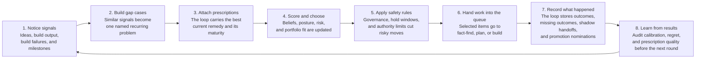
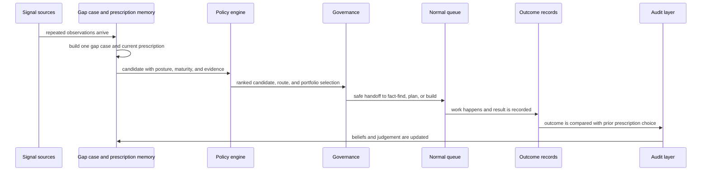
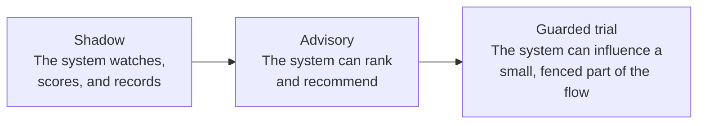

# Self Improving Loop

## Purpose

This page explains the self-improving loop.

It shows how the loop watches its own work, turns repeat friction and milestone changes into named problem cases, pairs those with the best current remedy, sends that work into the normal queue, and learns from the result.

## Big picture

The self-improving loop sits on top of the normal workflow.

It watches what the normal loop is doing, especially:

- repeated ideas
- repeated build problems
- repeated manual fixes
- repeated failures or reversions
- milestone changes that open new kinds of follow-through work

When those patterns show up often enough, the loop treats them as a signal that the process itself may need to improve.

```mermaid
flowchart LR
    A["1. Notice signals\nIdeas, build output,\nbuild failures, and milestones"]
    B["2. Build gap cases\nSimilar signals become\none named recurring problem"]
    C["3. Attach prescriptions\nThe loop carries the best\ncurrent remedy and its maturity"]
    D["4. Score and choose\nBeliefs, posture, risk,\nand portfolio fit are updated"]
    E["5. Apply safety rules\nGovernance, hold windows,\nand authority limits cut risky moves"]
    F["6. Hand work into the queue\nSelected items go to\nfact-find, plan, or build"]
    G["7. Record what happened\nThe loop stores outcomes,\nmissing outcomes, shadow handoffs,\nand promotion nominations"]
    H["8. Learn from results\nAudit calibration, regret,\nand prescription quality before the next round"]

    A --> B --> C --> D --> E --> F --> G --> H --> A
```

The point is not to automate everything. The point is to make better choices over time, with evidence, and to make the loop's own judgement less naive from one round to the next.

## Three linked cycles

The self-improving loop is easier to understand if you think of it as three cycles working together.

### Sensing

First, the loop notices what keeps going wrong or taking too much effort.

This is the sensing cycle. It is about collecting enough raw signal to notice that a pattern may be real.

### Choosing

Second, the loop decides which patterns are worth acting on now.

This is the choosing cycle. It is about comparing possible improvements, applying limits, and selecting only a small set.

### Learning

Third, the loop compares its choices with later outcomes.

This is the learning cycle. It is about asking whether the loop was right, partly right, too cautious, or too confident.

All three cycles matter.

If sensing is weak, the loop misses real problems.

If choosing is weak, the loop chases the wrong work.

If learning is weak, the loop keeps making the same quality of decision forever.

## How the loop works

### 1. It notices repeat work

The loop starts by collecting signals from the work already happening around it.

Those signals come from:

- the ideas pipeline
- build output
- build failures
- milestone events

Milestone events matter because some useful follow-through only becomes relevant after the business changes shape.

The live system already knows about milestone roots such as:

- qualified lead or enquiry flow is now present
- transaction data is now available
- repeat signal is now present

One milestone does not have to create one blunt task.

It can open a small bundle of related follow-up work, and the loop can then decide which parts are relatively required now and which parts can wait.

Each signal is saved as an observation. An observation is a small record of what happened, where it happened, what kind of problem it was, and any evidence that came with it.

This gives the loop raw material to work with. A single signal may be noise. A pattern of similar signals is more interesting.

The quality of these observations matters a lot.

If they are vague, the loop cannot tell one kind of problem from another.

If they are too narrow, the loop misses recurrence because the same pain is described in slightly different words.

So the observation layer is doing an important job. It is turning messy workflow events into signals the loop can compare.

### 2. It turns signals into gap cases

When the loop sees similar observations coming back again and again, it groups them together.

That grouped problem becomes a gap case.

A gap case is the loop's way of saying:

"This looks like the same problem returning in different runs. It may be worth fixing in a more permanent way."

Each gap case has its own identity. That matters, because the loop needs to keep talking about the same problem over time instead of losing it and recreating it from scratch.

This grouping step is where the loop stops being a list of complaints and starts becoming a system.

Without grouping, every fresh failure would look new.

With grouping, the loop can say:

- this is happening again
- it is happening in the same part of the flow
- it may now be worth fixing in a durable way

### 3. It pairs the problem with a prescription

The loop now keeps two linked ideas together:

- the named recurring problem
- the current best idea of what to do next

That second part is the prescription.

A prescription is not just a slogan like "improve measurement" or "fix market research."

It is the loop's current best structured remedy. It says, in effect:

"For this kind of problem, the next step probably belongs on this route, needs these inputs, should produce these artifacts, and should change this signal."

Some prescriptions are already fairly well formed.

Others start weaker and need more shaping.

The runtime still scores a candidate, but that candidate now carries the linked gap case and prescription instead of floating as a free-standing suggestion.

### 4. It keeps memory for the problem and the remedy

The loop keeps more than a title and a score. It keeps memory.

That memory includes:

- the problem statement
- the observations that triggered it
- the gap case identity
- the current prescription
- the evidence posture
- the requirement posture
- the prescription maturity
- the current belief state
- the latest known result, if one exists

This means the loop can remember whether a candidate is new, recurring, blocked, reverted, monitored, or already partly understood, and whether the remedy itself is still vague or already proven.

Without that memory, the loop would only be a recurrence detector. With memory, it becomes capable of learning.

This memory also stops the loop from becoming forgetful in a dangerous way.

If a candidate was already tried and failed, or was reviewed and deliberately held back, the loop should not behave as if none of that happened.

That is why candidate history is not an optional extra. It is what lets the loop build judgement instead of just spotting repetition.

### 5. It decides how necessary the work really is

The loop does not treat every possible improvement as equally urgent.

It now carries a requirement posture for the work:

- `absolute_required` means the issue should not be skipped because it blocks safe or valid progress
- `relative_required` means it matters, but still competes with other work for a slot now
- `optional_improvement` means it may help, but can wait without breaking the loop

This matters because almost everything can be improved.

The harder question is whether it should be improved now.

Without this posture, the loop would keep confusing "worth noticing" with "must do next."

### 6. It decides how well formed the remedy is

The loop also carries a maturity view for the prescription itself.

That maturity can move through states like:

- `unknown`
- `hypothesized`
- `structured`
- `proven`
- `retired`

This is important because the first time a new kind of gap appears, the loop may not yet know the right fix.

In that case, the correct action is not fake certainty. It is discovery.

If the prescription is still `unknown` or only `hypothesized`, the system forces the work back to `lp-do-fact-find` with a discovery contract.

That fact-find is meant to turn a vague remedy into a more structured one by naming candidate prescriptions, the inputs they need, the artifacts they should create, and the first prescription worth trying.

### 7. It scores the candidates

The policy layer reads the candidate memory and decides how promising each candidate looks.

It does not only ask, "How often did this happen?"

It also looks at:

- likely value
- likely effort
- risk
- blast radius
- outcome history
- uncertainty

This turns the candidate list into something the loop can reason about.

Some candidates are obvious and well supported. Others are uncertain. The policy layer can treat them differently.

This is where belief starts to matter.

The loop is not only storing facts about the candidate. It is also storing a view of how believable those facts are.

For example:

- a candidate with many repeat observations may still be weak if all the evidence is structural and none of it is measured
- a candidate with fewer observations may still matter if the downside is large
- a candidate may look promising, but still carry too much uncertainty to deserve a strong route

So the policy layer is not just counting. It is judging under uncertainty.

### 8. It builds a portfolio, not just a ranking

The loop does not simply pick the single highest score and ignore the rest.

Instead, it builds a portfolio: a small set of candidates worth acting on now.

That matters because the loop is always working under limits. Even if many candidates look useful, only some should move forward at the same time.

So the loop tries to choose a set that is:

- useful enough
- safe enough
- small enough
- varied enough to keep learning

This is also where exploration appears. If the loop is too conservative, it only repeats what it already believes. If it is too adventurous, it creates noise. The portfolio step is where that balance starts.

This is one of the deepest parts of the loop.

The loop is trying to answer two questions at once:

- what is most worth doing now
- what do we still need to learn

Those questions are not the same.

If the loop only follows the safest-looking option, it may become narrow and stale.

If it chases uncertainty too often, it may waste time and damage trust.

So the portfolio is doing more than ranking. It is balancing exploitation and learning.

### 9. It applies control before anything moves

Before the selected candidates are handed off, the governance layer checks whether the choices are stable.

This is where the loop tries to avoid thrashing.

A raw score can change quickly from one run to the next. Governance slows that down when needed. It can hold choices in place, limit how sharply the selected set changes, and record when a human or rule intervened.

So the system is not just:

"Pick whatever is highest right now."

It is closer to:

"Pick a sensible set, then keep the system steady enough for the results to mean something."

This matters because a self-improving loop can fool itself very easily.

If it changes too many things too quickly, then later outcomes become hard to interpret.

Was the improvement real?

Was the change caused by the new policy?

Was it just noise?

Governance helps protect the loop from learning the wrong lesson from unstable choices.

### 10. It hands work into the normal queue

Once a candidate survives scoring and control, it is handed back into the same queue as other work.

That handoff can send the work to:

- `lp-do-fact-find`
- `lp-do-plan`
- `lp-do-build`

This is important. The self-improving loop does not run outside the real workflow. It does not create a private side road where improvement work escapes normal discipline.

It sends work into the same queue, where it has to be understood, planned, and built like anything else.

That is a big design choice.

It means the self-improving loop is not allowed to grade its own homework in private.

Its candidates have to survive contact with the same fact-finding, planning, and build discipline as any other work item.

### 11. It records what happened after handoff

After the queued work moves forward, the loop records what happened.

That record may show:

- a verified outcome
- a missing outcome
- a shadow handoff
- a still-pending state
- a censored state where the result is not ready to judge yet

This gives the loop a bridge between expectation and reality.

The loop is not only asking:

"What did we choose?"

It is also asking:

"What happened after we chose it?"

This is the closure seam.

If the loop cannot connect a decision to what happened later, then it cannot tell the difference between:

- a good idea that worked
- a good idea that was never really tried
- a bad idea that was correctly rejected
- an uncertain idea that still needs more time

Outcome closure is what turns action into learning.

### 12. It learns from the results and nominates proven remedies

The audit layer reads the stored decisions and compares them with later results.

This is where the loop checks whether its own judgement is improving.

It can look at things like:

- calibration — whether confidence matched reality
- regret — whether better choices were available
- overrides — where humans stepped in
- policy version quality over time

That learning then feeds the next run.

So the next time the loop scores candidates, it can use more than recurrence alone. It can use the memory of what worked, what failed, and where it was too sure or not sure enough.

That feedback is what makes the loop self-improving.

This is also where the loop can nominate a prescription for promotion.

That does not mean every successful idea rewrites the system.

The promotion path separates:

- proof that the prescription worked often enough
- safety about where it could be reused

Most nominations stay advisory. Today only a very narrow low-risk autofix surface is allowed to act directly in guarded trial.

The loop is not self-improving because it generates ideas about itself.

It is self-improving because each round can change the quality of the next round's judgement.

## One case through the loop

It helps to see one case move through the system.

Imagine the same build pain appears several times:

- a manual step keeps being repeated during builds
- the same fix keeps being rediscovered
- the same class of failure keeps showing up in output and post-build notes

The loop would handle that pattern like this:

```mermaid
sequenceDiagram
    participant S as Signal sources
    participant C as Gap case and prescription memory
    participant P as Policy engine
    participant G as Governance
    participant Q as Normal queue
    participant O as Outcome records
    participant A as Audit layer

    S->>C: repeated observations arrive
    C->>C: build one gap case and current prescription
    C->>P: candidate with posture, maturity, and evidence
    P->>G: ranked candidate, route, and portfolio selection
    G->>Q: safe handoff to fact-find, plan, or build
    Q->>O: work happens and result is recorded
    O->>A: outcome is compared with prior prescription choice
    A->>C: beliefs and judgement are updated
```

The important point is that the case does not disappear when the work leaves the queue.

The loop keeps watching it before, during, and after the handoff.

That is how it learns whether its earlier judgement was sound.

## How evidence gets stronger

Not all evidence is equal.

The loop tries to move from weaker evidence toward stronger evidence.

### Structural evidence

This is evidence that something happened in the workflow.

For example:

- repeated build failures
- repeated manual fixes
- repeated follow-up work

Structural evidence is useful because it shows recurrence.

But it does not yet prove that a change improved the outcome.

### Measured evidence

This is evidence tied to a measurable effect.

For example:

- time saved
- failure rate reduced
- fewer repeats of the same manual step

Measured evidence is stronger because it starts to connect a change with an effect you can compare.

### Verified evidence

This is measured evidence that has survived enough checking to be trusted.

That usually means the outcome is linked back to the candidate, the measurement window is known, and the result is not just a one-off snapshot with no context.

The loop needs this ladder of evidence because self-improvement can easily become storytelling.

A team can feel that a change helped.

The loop is trying to know whether it helped.

## How the loop changes its own judgement

The loop does not only collect new facts. It also updates how it judges similar problems in the future.

That update can happen in several ways.

### It changes confidence

If the loop keeps making correct calls in one kind of situation, confidence can rise.

If it keeps being wrong, confidence should fall.

### It changes route strength

Some candidates deserve fact-find because the evidence is still weak.

Others deserve direct planning or build attention because the pattern is clearer and the risk is controlled.

The loop learns that difference over time.

### It changes what counts as urgent

Some issues start as relative improvements and only later become close to mandatory.

Others stay useful but deferrable.

The loop now keeps a separate view of whether work is absolutely required, relatively required, or only an optional improvement, so it can become better at choosing what matters now instead of merely noticing what could be better.

### It changes how formed a remedy has to be

The loop also updates whether a remedy is still unknown, only hypothesized, already structured enough to plan, or proven enough to reuse.

That stops the system from pretending every repeated pain already has a ready-made answer.

### It changes how much it explores

If the loop is already well calibrated in one area, it may not need much exploration there.

If it is uncertain or repeatedly surprised, it may need to learn more before becoming confident.

### It changes how cautious it is

If one class of decision creates instability or poor outcomes, the loop should become more conservative there.

If another class is consistently well judged, it may be safe to give that class a little more room.

This is why the loop needs both memory and audit.

Without memory, it forgets the past.

Without audit, it remembers the past but does not know what it means.

## What the loop stores

The self-improving loop works because it keeps several kinds of records at once.

### Observations

These are the raw signals. They describe repeated work, failures, build pain, and other process friction.

### Gap cases

These are the named recurring problems the loop is tracking. A gap case is more stable than a raw observation.

### Prescriptions

These are the current best remedies for a gap case. A prescription says what route the work likely needs, what inputs it needs, what artifacts it should produce, and what signal it hopes to change.

### Candidates

These are the runtime scoring objects the policy engine acts on. They now carry the linked gap case and prescription instead of floating as isolated suggestions.

### Policy state

This is the loop's working memory about belief, confidence, authority level, and active constraint profile.

### Policy decisions

These are the decisions the loop made: route choices, prescription choices, portfolio choices, exploration order, promotion-gate judgements, and promotion nominations.

### Lifecycle events

These show what happened to a candidate over time: when it was generated, when it was handed off, and when an outcome was recorded or missed.

### Shadow handoffs

These show what the loop would have sent forward in shadow mode, without actually changing the queue. They are useful because they let the loop compare hypothetical decisions with later reality.

### Milestone provenance

These records show when a business change, not just a failure, opened a new area of improvement work. They keep the source and timing of milestone-driven follow-up clear.

Together, these records let the loop compare:

- what it saw
- what it believed
- what it chose
- what happened afterwards

That chain is what makes learning possible.

This stored chain also makes the loop inspectable.

When the loop makes a poor decision, the goal is not just to notice that it was poor.

The goal is to be able to ask:

- was the signal weak
- was the grouping wrong
- was the policy too confident
- did governance fail to slow it down
- did the queue work never really close

That is a much more useful kind of failure than a black box mistake.

## Safety ladder

The self-improving loop does not behave the same way at all times. It has different modes of authority.

```mermaid
flowchart LR
    S["Shadow\nThe system watches,\nscores, and records"]
    A["Advisory\nThe system can rank\nand recommend"]
    G["Guarded trial\nThe system can influence a\nsmall, fenced part of the flow"]

    S --> A --> G
```

### Shadow

In `Shadow`, the loop watches the workflow, scores candidates, and records what it would have done.

It learns without changing the queue.

Shadow is valuable because it lets the loop build a history before it is trusted with influence.

The loop can ask:

- what would I have selected
- what actually happened instead
- would my choice have been better, worse, or simply different

### Advisory

In `Advisory`, the loop can rank and recommend candidates, but a human still decides what to act on.

The loop is now part of the judgement process, but not yet part of the actuation path.

Advisory mode is where the loop starts to prove whether its recommendations are useful to a human operator.

If the advice is consistently poor, the loop should not move upward.

If the advice is consistently strong, the loop can earn more trust.

### Guarded trial

In `Guarded trial`, the loop can influence a small, fenced part of the workflow.

This is the narrowest form of real control. The loop is now affecting what happens next, but only inside a bounded, monitored area.

That influence is still selective.

Most prescription promotions remain nominations for a human or later review.

Only a very narrow low-risk autofix surface is allowed to apply directly.

Guarded trial exists because full control is not the first goal.

The first goal is to find out whether the loop can influence real work without becoming unstable, overconfident, or hard to audit.

## What can go wrong

The self-improving loop is useful, but it has failure modes of its own.

### It can chase noise

If the signal layer is weak, the loop may treat random recurrence as a meaningful pattern.

### It can become too confident

If the loop starts trusting thin evidence, it may route work too strongly and too early.

### It can become too timid

If the loop only waits for perfect evidence, it may never help with real improvement.

### It can forget why a choice was made

If decision records are weak, later audits cannot tell whether a result came from bad judgement, missing evidence, or simple bad luck.

### It can learn from the wrong window

If outcomes are recorded too early, too late, or without enough context, the loop may update itself on the basis of misleading data.

That is why the system has safety ladders, hold windows, and audit surfaces.

The loop is not trying to be fearless.

It is trying to become more reliable without fooling itself.

## Why this matters

Without the self-improving loop, the startup loop can still do useful work, but it does not improve its own judgement very well.

It can spot work. It can route work. It can finish work.

But it is weaker at learning whether its own decisions are getting better.

The self-improving loop adds that extra layer. It helps the system notice repeated friction, remember what it has already tried, compare decisions with outcomes, and make the next round of choices a little better than the last.
