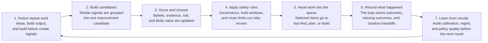
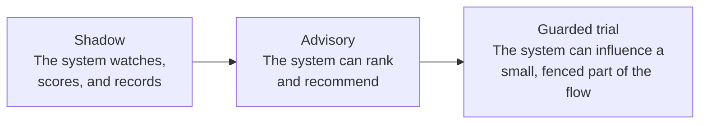

# Self Improving Loop

## Purpose

This page explains the self-improving loop.

It shows how the loop watches its own work, turns repeat friction into improvement candidates, sends that work into the normal queue, and learns from the result.

## Big picture

The self-improving loop sits on top of the normal workflow.

It watches what the normal loop is doing, especially:

- repeated ideas
- repeated build problems
- repeated manual fixes
- repeated failures or reversions

When those patterns show up often enough, the loop treats them as a signal that the process itself may need to improve.

```mermaid
flowchart LR
    A["1. Notice repeat work\nIdeas, build output,\nand build failure create signals"]
    B["2. Build candidates\nSimilar signals are grouped\ninto one improvement candidate"]
    C["3. Score and choose\nBeliefs, evidence, risk,\nand likely value are updated"]
    D["4. Apply safety rules\nGovernance, hold windows,\nand route limits cut risky moves"]
    E["5. Hand work into the queue\nSelected items go to\nfact-find, plan, or build"]
    F["6. Record what happened\nThe loop stores outcomes,\nmissing outcomes, and shadow handoffs"]
    G["7. Learn from results\nAudit calibration, regret,\nand policy quality before the next round"]

    A --> B --> C --> D --> E --> F --> G --> A
```

The point is not to automate everything. The point is to make better choices over time, with evidence.

## How the loop works

### 1. It notices repeat work

The loop starts by collecting signals from the work already happening around it.

Those signals come from:

- the ideas pipeline
- build output
- build failures

Each signal is saved as an observation. An observation is a small record of what happened, where it happened, what kind of problem it was, and any evidence that came with it.

This gives the loop raw material to work with. A single signal may be noise. A pattern of similar signals is more interesting.

### 2. It turns repeat signals into candidates

When the loop sees similar observations coming back again and again, it groups them together.

That group becomes an improvement candidate.

A candidate is the loop's way of saying:

"This looks like the same problem returning in different runs. It may be worth fixing in a more permanent way."

Each candidate has its own identity. That matters, because the loop needs to keep talking about the same problem over time instead of losing it and recreating it from scratch.

### 3. It keeps memory for each candidate

The loop keeps more than a title and a score. It keeps memory.

That memory includes:

- the problem statement
- the observations that triggered it
- the likely route for follow-up work
- the evidence posture
- the current belief state
- the latest known result, if one exists

This means the loop can remember whether a candidate is new, recurring, blocked, reverted, monitored, or already partly understood.

Without that memory, the loop would only be a recurrence detector. With memory, it becomes capable of learning.

### 4. It scores the candidates

The policy layer reads the candidate memory and decides how promising each candidate looks.

It does not only ask, "How often did this happen?"

It also looks at:

- likely value
- likely effort
- risk
- blast radius
- outcome history
- uncertainty

This turns the candidate list into something the loop can reason about.

Some candidates are obvious and well supported. Others are uncertain. The policy layer can treat them differently.

### 5. It builds a portfolio, not just a ranking

The loop does not simply pick the single highest score and ignore the rest.

Instead, it builds a portfolio: a small set of candidates worth acting on now.

That matters because the loop is always working under limits. Even if many candidates look useful, only some should move forward at the same time.

So the loop tries to choose a set that is:

- useful enough
- safe enough
- small enough
- varied enough to keep learning

This is also where exploration appears. If the loop is too conservative, it only repeats what it already believes. If it is too adventurous, it creates noise. The portfolio step is where that balance starts.

### 6. It applies control before anything moves

Before the selected candidates are handed off, the governance layer checks whether the choices are stable.

This is where the loop tries to avoid thrashing.

A raw score can change quickly from one run to the next. Governance slows that down when needed. It can hold choices in place, limit how sharply the selected set changes, and record when a human or rule intervened.

So the system is not just:

"Pick whatever is highest right now."

It is closer to:

"Pick a sensible set, then keep the system steady enough for the results to mean something."

### 7. It hands work into the normal queue

Once a candidate survives scoring and control, it is handed back into the same queue as other work.

That handoff can send the work to:

- `lp-do-fact-find`
- `lp-do-plan`
- `lp-do-build`

This is important. The self-improving loop does not run outside the real workflow. It does not create a private side road where improvement work escapes normal discipline.

It sends work into the same queue, where it has to be understood, planned, and built like anything else.

### 8. It records what happened after handoff

After the queued work moves forward, the loop records what happened.

That record may show:

- a verified outcome
- a missing outcome
- a shadow handoff
- a still-pending state
- a censored state where the result is not ready to judge yet

This gives the loop a bridge between expectation and reality.

The loop is not only asking:

"What did we choose?"

It is also asking:

"What happened after we chose it?"

### 9. It learns from the results

The audit layer reads the stored decisions and compares them with later results.

This is where the loop checks whether its own judgement is improving.

It can look at things like:

- calibration — whether confidence matched reality
- regret — whether better choices were available
- overrides — where humans stepped in
- policy version quality over time

That learning then feeds the next run.

So the next time the loop scores candidates, it can use more than recurrence alone. It can use the memory of what worked, what failed, and where it was too sure or not sure enough.

## What the loop stores

The self-improving loop works because it keeps several kinds of records at once.

### Observations

These are the raw signals. They describe repeated work, failures, build pain, and other process friction.

### Candidates

These are grouped problems that the loop may want to improve. A candidate is more stable than a raw observation.

### Policy state

This is the loop's working memory about belief, confidence, authority level, and active constraint profile.

### Policy decisions

These are the decisions the loop made: route choices, portfolio choices, exploration order, and promotion-gate judgements.

### Lifecycle events

These show what happened to a candidate over time: when it was generated, when it was handed off, and when an outcome was recorded or missed.

### Shadow handoffs

These show what the loop would have sent forward in shadow mode, without actually changing the queue. They are useful because they let the loop compare hypothetical decisions with later reality.

Together, these records let the loop compare:

- what it saw
- what it believed
- what it chose
- what happened afterwards

That chain is what makes learning possible.

## Safety ladder

The self-improving loop does not behave the same way at all times. It has different modes of authority.

```mermaid
flowchart LR
    S["Shadow\nThe system watches,\nscores, and records"]
    A["Advisory\nThe system can rank\nand recommend"]
    G["Guarded trial\nThe system can influence a\nsmall, fenced part of the flow"]

    S --> A --> G
```

### Shadow

In `Shadow`, the loop watches the workflow, scores candidates, and records what it would have done.

It learns without changing the queue.

### Advisory

In `Advisory`, the loop can rank and recommend candidates, but a human still decides what to act on.

The loop is now part of the judgement process, but not yet part of the actuation path.

### Guarded trial

In `Guarded trial`, the loop can influence a small, fenced part of the workflow.

This is the narrowest form of real control. The loop is now affecting what happens next, but only inside a bounded, monitored area.

## Why this matters

Without the self-improving loop, the startup loop can still do useful work, but it does not improve its own judgement very well.

It can spot work. It can route work. It can finish work.

But it is weaker at learning whether its own decisions are getting better.

The self-improving loop adds that extra layer. It helps the system notice repeated friction, remember what it has already tried, compare decisions with outcomes, and make the next round of choices a little better than the last.
