# Startup Loop Workflow (HEAD + PET + BRIK)

## 1) Purpose

Define the full startup operating loop from idea/spec input to execution and lp-replanning, with explicit inputs, processing, outputs, and current remaining data gaps for HEAD, PET, and BRIK.

## 2) End-to-End Loop (Complete Data Flow)

```mermaid
flowchart TD
    subgraph INPUT["📥 INPUTS"]
        A1[Business Idea]
        A2[Product Spec]
        A3[Constraints]
        A4[Historical Data<br/>for existing businesses]
    end

    subgraph S0_INTAKE["S0: Intake"]
        B1[Normalize Intent]
        B2[Structure Context]
        B1 --> B2
    end

    subgraph S1_READINESS["S1: Readiness"]
        C1[Gate Checks<br/>RG-01 to RG-07]
        C2{Pass?}
        C1 --> C2
    end

    subgraph S1B_S2A["S1B/S2A: Conditional Gates"]
        D1[Pre-website:<br/>Measurement Bootstrap]
        D2[Website-live:<br/>Historical Baseline]
    end

    subgraph S2_RESEARCH["S2: Market Intelligence"]
        E1[Deep Research]
        E2[Competitor Analysis]
        E3[Demand/Pricing Data]
        E1 --> E2 --> E3
    end

    subgraph S2B_OFFER["S2B: Offer Design"]
        F1[ICP Definition]
        F2[Positioning]
        F3[Pricing Model]
        F1 --> F2 --> F3
    end

    subgraph PARALLEL["⚡ PARALLEL EXECUTION"]
        S3_FORECAST["S3: Forecast<br/>────────<br/>P10/P50/P90<br/>Assumptions<br/>Test Metrics"]
        S6B_CHANNELS["S6B: Channels<br/>────────<br/>GTM Strategy<br/>SEO Plan<br/>Outreach Scripts"]
    end

    subgraph S4_MERGE["S4: Baseline Merge"]
        G1[Validate Artifacts]
        G2[Compose Snapshot]
        G3[Draft Manifest]
        G1 --> G2 --> G3
    end

    subgraph S5_PRIORITIZE["S5A/S5B: Prioritize + Sync"]
        H1[Score Go-Items]
        H2[Rank by Impact]
        H3[Persist to BOS D1]
        H1 --> H2 --> H3
    end

    subgraph S6_UPGRADE["S6: Site Upgrade"]
        I1[Platform Baseline]
        I2[Best-Of Analysis]
        I3[Adopt/Adapt Matrix]
        I1 --> I2 --> I3
    end

    subgraph EXECUTION["🔨 EXECUTION LOOP"]
        S7[S7: Fact-find<br/>────────<br/>Evidence Audit<br/>Task Seeds]
        S8[S8: Plan<br/>────────<br/>Confidence-Gated<br/>Task Breakdown]
        S9[S9: Build<br/>────────<br/>Implementation<br/>Validation]
        S9B[S9B: QA Gates<br/>────────<br/>Launch Checks<br/>Design/Perf Audit]
        S7 --> S8 --> S9 --> S9B
    end

    subgraph S10_DECISION["S10: Weekly Decision"]
        J1[Measure KPIs]
        J2[Gate Checks]
        J3{Keep/Pivot/<br/>Scale/Kill?}
        J4[Learning Ledger]
        J1 --> J2 --> J3 --> J4
    end

    subgraph ARTIFACTS["📦 KEY ARTIFACTS"]
        ART1[Intake Packet]
        ART2[Readiness Report]
        ART3[Market Intel Pack]
        ART4[Offer Artifact]
        ART5[Forecast Doc]
        ART6[Channel Plan]
        ART7[Baseline Snapshot]
        ART8[Prioritization Scorecard]
        ART9[Fact-find Brief]
        ART10[Plan Doc]
        ART11[Build Evidence]
        ART12[Weekly K/P/C/S Decision]
    end

    INPUT --> S0_INTAKE
    S0_INTAKE --> ART1
    ART1 --> S1_READINESS
    S1_READINESS --> ART2

    C2 -->|Blocked| C1
    C2 -->|Ready| S1B_S2A

    S1B_S2A --> S2_RESEARCH
    A4 --> S1B_S2A

    S2_RESEARCH --> ART3
    ART3 --> S2B_OFFER
    S2B_OFFER --> ART4

    ART4 --> S3_FORECAST
    ART4 --> S6B_CHANNELS
    ART3 --> S3_FORECAST
    ART3 --> S6B_CHANNELS

    S3_FORECAST --> ART5
    S6B_CHANNELS --> ART6

    ART5 --> S4_MERGE
    ART6 --> S4_MERGE
    ART4 --> S4_MERGE

    S4_MERGE --> ART7
    ART7 --> S5_PRIORITIZE
    S5_PRIORITIZE --> ART8

    ART8 --> S6_UPGRADE
    S6_UPGRADE --> EXECUTION

    EXECUTION --> ART9
    ART9 --> ART10
    ART10 --> ART11

    ART11 --> S10_DECISION
    S10_DECISION --> ART12

    J3 -->|Continue/Pivot| S2_RESEARCH
    J3 -->|Scale| S5_PRIORITIZE
    J3 -->|Kill| J4

    style INPUT fill:#e3f2fd
    style ARTIFACTS fill:#fff3e0
    style PARALLEL fill:#f3e5f5
    style EXECUTION fill:#e8f5e9
    style S10_DECISION fill:#fce4ec
```



### 2.1 Existing-Business Route (BRIK) - Data Flow Detail

For website-live businesses like BRIK, use this route with historical baseline gate:


**Critical Rule:** BRIK does not proceed past S2/S6 while the S2A historical baseline is missing or draft.

**Data Flow:**
- S2A baseline → consumed by S2 (market sizing validation), S3 (forecast anchoring), S6 (traffic patterns), S10 (growth measurement)
- When S2A is blocked due to missing data, workflow hands user the S2A data-request prompt and pauses until data pack is supplied
- S10 weekly decisions compare measured actuals vs baseline to calculate growth rate and trigger recalibration when guardrails break

### 2.2 Detailed Stage Data Flow (Inputs → Processing → Outputs)


### 2.3 Artifact Production & Consumption Chain

```mermaid
flowchart TB
    subgraph FOUNDATIONAL["🏗️ FOUNDATIONAL ARTIFACTS Single-source, Long-lived"]
        direction TB
        A1["📄 intake-packet.user.md<br/>────────<br/>Produced by: S0<br/>Consumed by: S1, S2, S2B, all downstream<br/>Lifecycle: Update on major scope change<br/>Location: docs/business-os/startup-baselines/"]

        A2["📄 readiness-report.user.md<br/>────────<br/>Produced by: S1<br/>Consumed by: S2 blocker resolution<br/>Lifecycle: Regenerate on major change<br/>Location: docs/business-os/readiness/"]

        A3["📄 historical-baseline.user.md S2A<br/>────────<br/>Produced by: S2A website-live only<br/>Consumed by: S2, S3, S10<br/>Lifecycle: Refresh weekly first 30 days<br/>Location: docs/business-os/strategy/BIZ/"]

        A4["📄 measurement-setup.user.md S1B<br/>────────<br/>Produced by: S1B pre-website only<br/>Consumed by: S2, S3, launch checklist<br/>Lifecycle: Complete before paid traffic<br/>Location: docs/business-os/strategy/BIZ/"]

        A1 --> A2
        A2 --> A3
        A2 --> A4
    end

    subgraph RESEARCH["🔬 RESEARCH ARTIFACTS Refresh Monthly/Quarterly"]
        direction TB
        B1["📄 market-intelligence.user.md<br/>+ latest.user.md pointer<br/>────────<br/>Produced by: S2 Deep Research<br/>Consumed by: S2B, S3, S6B<br/>Refresh: Monthly or on material change<br/>Location: docs/business-os/market-research/BIZ/"]

        B2["📄 platform-capability-baseline.user.md<br/>+ latest.user.md pointer<br/>────────<br/>Produced by: Periodic Deep Research<br/>Consumed by: S6<br/>Refresh: Every 30-45 days<br/>Location: docs/business-os/platform-capability/"]

        B3["📄 upgrade-brief.user.md<br/>+ latest.user.md pointer<br/>────────<br/>Produced by: S6 Deep Research<br/>Consumed by: S7 backlog packet<br/>Refresh: Monthly or on ICP/channel change<br/>Location: docs/business-os/site-upgrades/BIZ/"]
    end

    subgraph STRATEGIC["🎯 STRATEGIC PLANNING ARTIFACTS Core Baseline"]
        direction TB
        C1["📄 offer-artifact.user.md<br/>────────<br/>Produced by: S2B /lp-offer<br/>Consumed by: S3, S6B, S4<br/>Dependencies: Market intel S2<br/>Location: docs/business-os/startup-baselines/BIZ/"]

        C2["📄 90-day-forecast.user.md<br/>+ forecast-seed.user.md<br/>+ exec-summary.user.md<br/>────────<br/>Produced by: S3 /lp-forecast<br/>Consumed by: S4, S5A, S10<br/>Dependencies: Offer S2B, Market intel S2<br/>Recalibration: Day 14, then monthly<br/>Location: docs/business-os/strategy/BIZ/"]

        C3["📄 channel-plan.user.md<br/>+ seo-strategy.user.md<br/>+ outreach-drafts.user.md<br/>────────<br/>Produced by: S6B /lp-channels + /lp-seo<br/>Consumed by: S4, S7 marketing items<br/>Dependencies: Offer S2B, Market intel S2<br/>Location: docs/business-os/startup-baselines/BIZ/"]

        C4["📦 baseline-snapshot.json<br/>+ manifest.json<br/>────────<br/>Produced by: S4 /lp-baseline-merge<br/>Consumed by: S5A, S5B manifest commit<br/>Dependencies: Offer C1, Forecast C2, Channels C3<br/>Lifecycle: Immutable per runId<br/>Location: docs/business-os/startup-baselines/BIZ/runs/RUNID/"]

        C5["📄 prioritization-scorecard.user.md<br/>────────<br/>Produced by: S5A /lp-prioritize<br/>Consumed by: S5B, S7 item selection<br/>Dependencies: Baseline snapshot C4<br/>Refresh: Weekly or on new candidate<br/>Location: docs/business-os/strategy/BIZ/"]
    end

    subgraph BOS_ENTITIES["💾 BUSINESS OS PERSISTED ENTITIES D1 Database"]
        direction TB
        D1["🗂️ BOS Cards + Stage Docs<br/>────────<br/>Produced by: S5B /lp-bos-sync<br/>Consumed by: S7, S8, S9, S10<br/>Write path: POST/PATCH /api/agent/*<br/>Read path: MCP bos_* tools<br/>Persistence: D1 apps/business-os"]

        D2["📍 Committed Manifest Pointer<br/>────────<br/>Produced by: S5B<br/>Consumed by: All subsequent runs<br/>Purpose: Lock baseline as 'current'<br/>Location: docs/business-os/startup-baselines/BIZ/manifest.json"]
    end

    subgraph EXECUTION["⚙️ EXECUTION ARTIFACTS Per Card/Plan"]
        direction TB
        E1["📄 fact-find.md<br/>────────<br/>Produced by: S7 /lp-fact-find<br/>Consumed by: S8<br/>BOS sync: Stage doc upsert<br/>Location: docs/plans/FEATURE-SLUG/"]

        E2["📄 plan.md<br/>────────<br/>Produced by: S8 /lp-plan<br/>Consumed by: S9<br/>BOS sync: Stage doc + lane transition<br/>Location: docs/plans/FEATURE-SLUG/"]

        E3["📄 build.md + shipped code<br/>────────<br/>Produced by: S9 /lp-build<br/>Consumed by: S9B, S10<br/>BOS sync: Stage doc + Done lane<br/>Evidence: git commits, test results<br/>Location: docs/plans/FEATURE-SLUG/ + apps/*"]

        E4["📄 qa-report.md<br/>────────<br/>Produced by: S9B /lp-launch-qa<br/>Consumed by: S10 go/no-go<br/>Contents: Issue inventory, deployment checklist<br/>Location: docs/plans/FEATURE-SLUG/"]
    end

    subgraph MEASUREMENT["📊 MEASUREMENT & DECISION ARTIFACTS Weekly Cadence"]
        direction TB
        F1["📄 weekly-kpcs-decision.user.md<br/>────────<br/>Produced by: S10 Weekly loop<br/>Consumed by: Loop restart S2/S5 or Kill<br/>Decision: Keep/Pivot/Scale/Kill<br/>Location: docs/business-os/strategy/BIZ/"]

        F2["📦 growth-ledger.json<br/>+ growth-event-payload.json<br/>+ stage-result.json<br/>────────<br/>Produced by: S10 diagnosis integration<br/>Consumed by: Forecast recalibration, replays<br/>Contents: Stage statuses, guardrail signals<br/>Location: data/shops/SHOPID/ + runs/RUNID/stages/S10/"]

        F3["📄 forecast-recalibration.user.md<br/>────────<br/>Produced by: S10 or ad-hoc on gate fail<br/>Consumed by: Updated strategy plan<br/>Trigger: Day 14, major assumption break<br/>Location: docs/business-os/strategy/BIZ/"]
    end

    A3 --> B1
    A4 --> B1
    B1 --> C1
    B1 --> C2
    B1 --> C3
    C1 --> C2
    C1 --> C3
    C1 --> C4
    C2 --> C4
    C3 --> C4
    C4 --> C5
    C5 --> D1
    C4 --> D2
    D1 --> E1
    D2 --> E1
    B2 --> B3
    B3 --> E1
    E1 --> E2
    E2 --> E3
    E3 --> E4
    E4 --> F1
    C2 --> F1
    E3 --> F2
    F1 --> F2
    F2 --> F3
    F3 -.refresh.-> C2
    F1 -.pivot.-> B1
    F1 -.scale.-> C5

    style FOUNDATIONAL fill:#e3f2fd
    style RESEARCH fill:#f3e5f5
    style STRATEGIC fill:#e8f5e9
    style BOS_ENTITIES fill:#fff3e0
    style EXECUTION fill:#fff9c4
    style MEASUREMENT fill:#ffebee
```



### 2.4 Human Operator View: MCP Overlay + Data Connections

```mermaid
flowchart LR
    subgraph LOOP[Startup Loop Control]
      U[Operator / Skill Runner] --> ST[S0..S10 stage execution]
    end

    subgraph MCP[MCP Data Plane - packages/mcp-server]
      PG[Policy gate\nallowedStages + permission + sideEffects]
      BOSR[bos_cards_list\nbos_stage_doc_get]
      LOOPR[loop_manifest_status\nloop_learning_ledger_status\nloop_metrics_summary]
      BOSW[bos_stage_doc_patch_guarded]
      MEAS[measure_* connectors\nwave-2 planned]
    end

    subgraph SOURCES[Pull Sources]
      API[Business OS agent API\napps/business-os/src/app/api/agent/*]
      RUN[startup-loop run artifacts\ndocs/business-os/startup-baselines/[BIZ]/runs/*\nstages/*/stage-result.json]
      DOCS[Strategy + readiness docs\ndocs/business-os/strategy/*\ndocs/business-os/readiness/*]
      APPS[Operational apps\napps/brikette + apps/prime + apps/reception]
      EXT[External analytics\nGA4 + Search Console + Cloudflare]
    end

    subgraph SINKS[Push / Process Targets]
      D1[BOS persisted entities\ncards + stage docs]
      LEDGER[S10 outputs\ndata/shops/[shopId]/growth-ledger.json\nstages/S10/growth-event-payload.json]
      PLAN[Planning artifacts\ndocs/plans/* + docs/business-os/*.user.md]
    end

    ST --> PG
    PG --> BOSR
    PG --> LOOPR
    PG --> BOSW
    PG -. planned .-> MEAS

    BOSR -- pull --> API
    LOOPR -- pull --> RUN
    LOOPR -- pull --> DOCS
    MEAS -. pull .-> APPS
    MEAS -. pull .-> EXT

    BOSW -- guarded push --> API
    API --> D1
    ST --> LEDGER
    ST --> PLAN
```

What this means for operators:

1. `bos_*` and `loop_*` tools are the current MCP startup-loop tools and are policy-gated by stage.
2. `measure_*` tools are not in current wave and remain a planned dependency for stronger S2A/S3/S10 measurement.
3. Writes to BOS remain guarded (`entitySha` + stage policy) through API contracts.

### 2.5 Open Tasks (Required Now, Simple Language)

| Required task | Why it is required | Evidence path |
|---|---|---|
| HEAD and PET operational confirmations are required. | Forecasts cannot become decision-grade without stock/date/units/price/compatibility/payments/returns confirmation. | `docs/business-os/startup-loop-workflow.user.md` section 5.2 and 5.3 |
| HEAD and PET forecast recalibration documents are required. | Weekly decisions need measured data, not only seed assumptions. | `docs/business-os/startup-loop-workflow.user.md` section 5.2 and 5.3 |
| BRIK GA4 verification for `web_vitals` plus post-deploy 7-day `begin_checkout` report confirmation is required. | S2A measurement is partially closed: live `begin_checkout` collect is verified, but report-level closure is pending until refreshed extraction confirms sustained signal. | `docs/business-os/strategy/BRIK/2026-02-13-measurement-verification.user.md` |
| BRIK first 7-day measured KPI baseline is now locked; weekly refresh is required. | Baseline now exists, but decision quality depends on continuous refresh and restoring non-zero funnel/vitals signals. | `docs/business-os/strategy/BRIK/plan.user.md`; `docs/business-os/strategy/BRIK/2026-02-13-measurement-verification.user.md` |
| BRIK day-14 forecast recalibration artifact is required. | S3 v1 assumptions must be replaced with measured week-1/2 evidence for reliable scale decisions. | `docs/business-os/strategy/BRIK/2026-02-13-startup-loop-90-day-forecast-v1.user.md` |
| BRIK prioritization execution routing packet is active; P1-01 baseline lock and production checkout deployment alignment are complete, and next action is post-deploy report refresh plus P1-02/P1-03 execution. | Routing and baseline artifacts are in place; remaining risk is execution throughput and signal restoration at report level. | `docs/plans/brik-ga4-baseline-lock/fact-find.md`; `docs/plans/brik-ga4-baseline-lock/plan.md`; `docs/business-os/strategy/BRIK/2026-02-13-prioritization-scorecard.user.md`; `docs/business-os/strategy/BRIK/plan.user.md` |
| BRIK weekly decision cadence continuation is required. | First S10 artifact exists, but loop health depends on sustained weekly decision updates. | `docs/business-os/strategy/BRIK/2026-02-13-weekly-kpcs-decision.user.md` |
| Startup standing refresh artifacts are required. | Market/channel/regulatory inputs go stale without periodic refresh documents. | `docs/business-os/startup-loop-workflow.user.md` section 5.1 and 12 |
| MCP TASK-05 identity/deployment decision is required. | Guarded write rollout cannot proceed safely without this decision. | `docs/plans/mcp-startup-loop-data-plane/plan.md` TASK-05 |
| MCP TASK-06 guarded BOS write rollout is required. | S5B/S7/S8/S9/S10 write paths need governed MCP write capability. | `docs/plans/mcp-startup-loop-data-plane/plan.md` TASK-06 |
| MCP wave-2 `measure_*` connectors are required. | S2A/S3/S10 need normalized cross-source measurement contracts. | `docs/plans/mcp-startup-loop-data-plane-wave-2/fact-find.md` |

## 3) Website Upgrade Sub-Loop


This sub-loop feeds the main startup loop at the lp-fact-find stage.

## 4) Stage-by-Stage Workflow (Input -> Processing -> Output)

Canonical source: `docs/business-os/startup-loop/loop-spec.yaml` (spec_version 1.1.0).

| Stage | Inputs | Processing | Outputs |
|---|---|---|---|
| S0. Intake | Business idea, product spec, channels, constraints, stock timeline | Normalize raw user intent into structured startup context | Intake packet per business |
| S1. Readiness preflight | Strategy plan, people profile, path-business mapping, prior cards/ideas | Run readiness gates (`RG-01..RG-07`) and detect blockers | Readiness report + missing-context register + blocker questions/prompts |
| S1B. Pre-website measurement bootstrap (conditional: pre-website) | Launch-surface mode = `pre-website` + intake packet + business plan | Run mandatory analytics/measurement setup gate and operator handoff (GA4/Search Console/API prereqs) | Measurement setup note + verification checklist + blocker list |
| S2A. Historical performance baseline (conditional: website-live) | Monthly net booking value exports + Cloudflare analytics + ops logs + Octorate data collection (Batch 1: booking value, Batch 2: calendar/inventory) | Consolidate internal history into decision baseline with data-quality notes | Historical baseline pack (`Status: Active` required before S2/S6 for existing businesses) + Octorate data collection protocol active |
| S2. Market intelligence | Deep Research prompt template + business intake packet (+ S2A baseline for existing businesses) | Competitor/demand/pricing/regulatory research, confidence tagging | Market Intelligence Pack per business + `latest` pointer |
| S2B. Offer design | Market intelligence + intake packet + constraints | Consolidate ICP, positioning, pricing, offer design into validated hypothesis | Offer artifact (`/lp-offer` output); BD-3 sub-deliverable: messaging-hierarchy.user.md (Draft minimum required before S2B is Done — GATE-BD-03) |
| *S3. Forecast* (parallel with S6B) | Business intake + fresh market intelligence + offer hypothesis | Build P10/P50/P90 forecast, guardrails, assumptions, 14-day tests | Forecast doc + exec summary + forecast seed |
| *S6B. Channel strategy + GTM* (parallel with S3) | Offer hypothesis + market intelligence + launch surface | Channel-customer fit analysis, 2-3 launch channels, 30-day GTM timeline | Channel plan + SEO strategy + outreach drafts |
| S4. Baseline merge (join barrier) | Offer (S2B) + forecast (S3) + channels (S6B) | Validate required upstream artifacts; compose deterministic baseline snapshot | Candidate baseline snapshot + draft manifest |
| S5A. Prioritize (no side effects) | Baseline snapshot + forecast + constraints | Score and rank go-item candidates | Prioritized backlog candidates (pure ranking, no persistence) |
| S5B. BOS sync (sole mutation boundary) | Prioritized items from S5A | Persist cards/stage-docs to D1; commit manifest pointer as current | BOS cards created/updated + manifest committed |
| S6. Website upgrade synthesis | Platform baseline + business upgrade brief + reference sites | Best-of decomposition and fit matrix (Adopt/Adapt/Defer/Reject) | Fact-find-ready website backlog packet |
| S7. Fact-find | Chosen go-item(s), evidence docs, constraints | Deep evidence audit and task seeds | Fact-find brief (`Ready-for-planning` or `Needs-input`) |
| S8. Plan | Fact-find brief | Confidence-gated implementation plan | Plan doc with tasks/VCs/checkpoints |
| S9. Build | Approved plan tasks | Implement + validate + track outputs | Shipped work + validation evidence |
| S9B. QA gates | Build outputs + design spec + performance budget | Launch QA, design QA, measurement verification | QA report + go/no-go recommendation |
| S10. Weekly decision loop | KPI scoreboard + gate metrics + costs + operational reliability + growth ledger outputs (`stage_statuses`, `overall_status`, `guardrail_signal`, `threshold_set_hash`) | K/P/C/S decisioning + replayability check against growth event payload | Continue/Pivot/Scale/Kill decision + linked growth artifacts (`stages/S10/stage-result.json`, `data/shops/{shopId}/growth-ledger.json`, `stages/S10/growth-event-payload.json`) + loop-back updates |

**Brand & Design touch-points (cross-cutting, enforced by advance gates):**

| Touch-point | Trigger | Processing | Output / Gate |
|---|---|---|---|
| BD-1 Brand Dossier bootstrap | S1 advance | GATE-BD-01 (Hard): check brand-dossier.user.md Draft/Active status in strategy index; block S1 advance if missing | Run `/lp-brand-bootstrap <BIZ>` → `brand-dossier.user.md` at Draft minimum |
| BD-2 Competitive Positioning | After S2 | Competitive positioning research via BRAND-DR-01/02 prompts | `competitive-positioning.user.md`; evidence pack entries under `docs/business-os/evidence/<BIZ>/` |
| BD-3 Messaging Hierarchy (S2B sub-deliverable) | S2B completion | GATE-BD-03 (Hard): messaging-hierarchy.user.md must exist at Draft minimum before S2B is Done | `messaging-hierarchy.user.md` at Draft minimum; S2B not Done without it |
| BD-4 Creative Voice Brief | After S6B | Creative voice brief derived from channel angles and messaging decisions (BRAND-DR-04) | `creative-voice-brief.user.md` |
| BD-5 Design Spec gate | S7/S8 (lp-design-spec pre-flight) | GATE-BD-07 (Hard): lp-design-spec requires Active brand-dossier; blocks design spec if Status ≠ Active | Gate pass → lp-design-spec runs; gate block → advance brand-dossier to Active first |
| BD-6 Brand Copy QA | S9B (`/lp-launch-qa`) | Domain 5 Brand Copy Compliance checks: BC-04 (words-to-avoid), BC-05 (claims in messaging hierarchy), BC-07 (voice audit) | Brand compliance verdict in QA report; pass required for go-live |

## 5) Current Missing Information (HEAD, PET, and BRIK)

### 5.1 Cross-cutting blockers (impact HEAD, PET, and BRIK)

| Missing item | Type | Why it blocks | Current evidence |
|---|---|---|---|
| Standing refresh outputs not yet started | Input freshness risk (Periodic) | Prompt templates exist, but no recurring refresh artifacts are persisted yet | No `market-pulse`, `channel-economics-refresh`, or `regulatory-claims-watch` docs found under `docs/business-os/` |

Resolved recently (no longer missing):
- Platform baseline is active: `docs/business-os/platform-capability/latest.user.md`.
- Market intelligence packs are active for HEAD and PET:
  - `docs/business-os/market-research/HEAD/latest.user.md`
  - `docs/business-os/market-research/PET/latest.user.md`
- BRIK market intelligence pack is active (decision-grade):
  - `docs/business-os/market-research/BRIK/latest.user.md`
- HEAD site-upgrade brief is active:
  - `docs/business-os/site-upgrades/HEAD/latest.user.md`
- PET site-upgrade brief is active:
  - `docs/business-os/site-upgrades/PET/latest.user.md`
- BRIK site-upgrade brief is active (decision-grade):
  - `docs/business-os/site-upgrades/BRIK/latest.user.md`
- Intake packets are active for HEAD and PET:
  - `docs/business-os/startup-baselines/HEAD-intake-packet.user.md`
  - `docs/business-os/startup-baselines/PET-intake-packet.user.md`
- Intake packet is active for BRIK:
  - `docs/business-os/startup-baselines/BRIK-intake-packet.user.md`
- Readiness mapping gate now passes for active scope:
  - `docs/business-os/readiness/2026-02-12-idea-readiness.user.md` (`Run-Status: warning`)
- Blocker interview packs are active for HEAD and PET:
  - `docs/business-os/readiness/2026-02-12-HEAD-blocker-interview.user.md`
  - `docs/business-os/readiness/2026-02-12-PET-blocker-interview.user.md`
- Outcome contracts are now locked in canonical plans:
  - `docs/business-os/strategy/HEAD/plan.user.md`
  - `docs/business-os/strategy/PET/plan.user.md`
  - `docs/business-os/strategy/BRIK/plan.user.md`
- Prioritization scorecards are active for HEAD, PET, and BRIK:
  - `docs/business-os/strategy/HEAD/2026-02-12-prioritization-scorecard.user.md`
  - `docs/business-os/strategy/PET/2026-02-12-prioritization-scorecard.user.md`
  - `docs/business-os/strategy/BRIK/2026-02-13-prioritization-scorecard.user.md`
- Weekly K/P/C/S decision logs have started for HEAD, PET, and BRIK:
  - `docs/business-os/strategy/HEAD/2026-02-12-weekly-kpcs-decision.user.md`
  - `docs/business-os/strategy/PET/2026-02-12-weekly-kpcs-decision.user.md`
  - `docs/business-os/strategy/BRIK/2026-02-13-weekly-kpcs-decision.user.md`

### 5.2 HEAD-specific gaps

| Stage | Missing information | Gap type | Evidence |
|---|---|---|---|
| S1 Readiness | Demand/conversion baselines still not measured | Input missing | `docs/business-os/strategy/HEAD/plan.user.md` metrics section |
| S3 Forecast | Region/tax still unresolved in some active decision docs (`Region: TBD`) | Input/consistency gap | `docs/business-os/strategy/HEAD/2026-02-11-week2-gate-dry-run.user.md`, `docs/business-os/strategy/HEAD/launch-readiness-action-backlog.user.md` |
| S3 Forecast | Key operational confirmations missing: in-stock date, sellable units, price architecture, compatibility matrix, payment readiness, returns SLA | Input missing | `docs/business-os/startup-baselines/HEAD-forecast-seed.user.md` section "Still missing / needs confirmation" |
| S3 Forecast | No post-launch recalibration artifact exists yet | Output missing | No `docs/business-os/strategy/HEAD/*-forecast-recalibration.user.md` |
| S4 Baseline merge | Baseline exists but remains draft and not yet promoted into canonical strategy outcome contract | Output not integrated | `docs/business-os/startup-baselines/HEAD-forecast-seed.user.md` + `docs/business-os/strategy/HEAD/plan.user.md` |

### 5.3 PET-specific gaps

| Stage | Missing information | Gap type | Evidence |
|---|---|---|---|
| S1 Readiness | Demand/margin baselines not measured in canonical plan | Input missing | `docs/business-os/strategy/PET/plan.user.md` metrics section |
| S3 Forecast | Forecast is not decision-grade until inventory units/arrival, real costs, and observed CPC/CVR are captured | Input missing | `docs/business-os/strategy/PET/italy-90-day-launch-forecast-v2.user.md` section "Required Data to Upgrade v2 -> Decision-Grade" |
| S3 Forecast | No post-launch recalibration artifact exists yet | Output missing | No `docs/business-os/strategy/PET/*-forecast-recalibration.user.md` |
| S4 Baseline merge | PET baseline now exists but remains draft and not yet promoted into canonical strategy outcome contract | Output not integrated | `docs/business-os/startup-baselines/PET-forecast-seed.user.md` + `docs/business-os/strategy/PET/plan.user.md` |

### 5.4 BRIK-specific gaps

| Stage | Missing information | Gap type | Evidence |
|---|---|---|---|
| S1 Readiness | Outcome contract is now in canonical startup-loop format; maintain weekly refresh against measured data | Freshness/cadence risk | `docs/business-os/strategy/BRIK/plan.user.md`; `docs/business-os/startup-baselines/BRIK-forecast-seed.user.md` |
| S1 Readiness | First 7-day measured baseline is now locked (sessions/users/page_view); conversion and vitals signals remain zero in current window | Signal-quality gap | `docs/business-os/strategy/BRIK/plan.user.md` metrics section; `docs/business-os/strategy/BRIK/2026-02-13-measurement-verification.user.md` |
| S2A Historical baseline | Baseline is active; Octorate data collection protocol established with Batch 2 (calendar/inventory) fully automated; Batch 1 (booking value) requires automation; Cloudflare proxies are partial (11/24 months request totals only; no page/geo/device splits) and older months are unavailable under current access | Data quality + automation gap | `docs/business-os/strategy/BRIK/2026-02-12-historical-performance-baseline.user.md` (`Status: Active`); `docs/business-os/strategy/BRIK/2026-02-14-octorate-operational-data-baseline.user.md` (`Status: Active`); `docs/business-os/startup-loop/octorate-data-collection-protocol.md` (`Status: Active`); `docs/business-os/strategy/BRIK/data/cloudflare_monthly_proxies.csv`; `docs/business-os/strategy/BRIK/data/data_quality_notes.md` |
| S2A Measurement setup | Data API access is enabled, first extract is captured, and production click-path now verifies live `begin_checkout` collection after deployment alignment; `web_vitals` verification and refreshed report-window confirmation remain pending | Signal-quality/verification gap | `docs/business-os/strategy/BRIK/2026-02-13-measurement-verification.user.md`; `docs/business-os/strategy/BRIK/plan.user.md`; setup note: `docs/business-os/strategy/BRIK/2026-02-12-ga4-search-console-setup-note.user.md` |
| S2 Market intelligence | Decision-grade pack is now active; enforce monthly freshness + change-trigger refresh | Refresh cadence risk | `docs/business-os/market-research/BRIK/2026-02-12-market-intelligence.user.md` (`Status: Active`); handoff prompt retained at `docs/business-os/market-research/BRIK/2026-02-12-deep-research-market-intelligence-prompt.user.md` |
| S3 Forecasting | Startup-loop forecast artifact is now active (`v1`); first measured-data recalibration remains pending | Refresh/recalibration risk | `docs/business-os/strategy/BRIK/2026-02-13-startup-loop-90-day-forecast-v1.user.md` (`Status: Active`); exec summary: `docs/business-os/strategy/BRIK/2026-02-13-startup-loop-90-day-forecast-v1-exec-summary.user.md` |
| S4 Baseline merge | Forecast seed is active and integrated into canonical plan; next action is controlled refresh/recalibration after measured week-1/2 data | Refresh/recalibration risk | `docs/business-os/startup-baselines/BRIK-forecast-seed.user.md` (`Status: Active`) + `docs/business-os/strategy/BRIK/plan.user.md` |
| S5 Prioritization | Scored prioritization artifact is active; P1-01 routing, baseline lock, and production checkout telemetry deployment alignment are complete, while report refresh verification and P1-02/P1-03 execution remain open | Execution sequencing risk | `docs/plans/brik-ga4-baseline-lock/fact-find.md`; `docs/plans/brik-ga4-baseline-lock/plan.md`; `docs/business-os/strategy/BRIK/2026-02-13-prioritization-scorecard.user.md` (`Status: Active`) |
| S6 Website synthesis | Decision-grade brief is now active; enforce monthly freshness + change-trigger refresh | Refresh cadence risk | `docs/business-os/site-upgrades/BRIK/2026-02-12-upgrade-brief.user.md` (`Status: Active`); handoff prompt retained at `docs/business-os/site-upgrades/BRIK/2026-02-12-deep-research-site-upgrade-prompt.user.md` |
| S10 Weekly decision loop | First weekly decision artifact is now active; maintain strict weekly cadence and link to gate evidence | Cadence risk | `docs/business-os/strategy/BRIK/2026-02-13-weekly-kpcs-decision.user.md` (`Status: Active`) |

## 6) Current State Snapshot by Stage (HEAD vs PET vs BRIK)

| Stage | HEAD | PET | BRIK |
|---|---|---|---|
| S0 Intake | Canonical intake packet active | Canonical intake packet active | Canonical intake packet active |
| S1 Readiness | Mapping gate clear; business-level outcome/metrics gaps remain | Mapping gate clear; business-level outcome/metrics gaps remain | Mapping gate clear; outcome contract normalized, but measured baseline metrics remain incomplete |
| S2A Historical baseline | Not required (startup mode) | Not required (startup mode) | Baseline active with partial Cloudflare coverage; GA4/Search Console core setup verified, event-level verification pending |
| S2 Market intelligence | Active canonical output (`latest` active) | Active canonical output (`latest` active) | Active canonical output (`latest` active; decision-grade) |
| S2B Offer design | Not yet started | Not yet started | Not yet started |
| S3 Forecast | v2 + market-intelligence inputs exist; still needs operational confirmations | v2 + market-intelligence inputs exist; still not decision-grade without observed data | Startup-loop forecast artifact active (`v1`); recalibration pending after first 14-day measured window |
| S6B Channel strategy + GTM | Not yet started | Not yet started | Not yet started |
| S4 Baseline merge | Draft seed exists (pre-merge format) | Draft seed exists (pre-merge format) | Seed active and integrated into canonical plan |
| S5A Prioritize | Scored prioritization artifact active | Scored prioritization artifact active | Scored prioritization artifact active |
| S5B BOS sync | Not yet started | Not yet started | Not yet started |
| S6 Website best-of synthesis | Active brief available | Active brief available | Active brief available (`latest` active; decision-grade) |
| S7 Fact-find handoff quality | Possible but weaker due missing upstream canonical artifacts | Possible but weaker due missing upstream canonical artifacts | Possible with improved quality; still constrained by measurement completeness and S6B artifact gaps |
| S8/S9 Plan/Build | Available in process, but depends on stronger upstream inputs | Available in process, but depends on stronger upstream inputs | Available in process; confidence improved after S2/S3/S4/S5/S6 completion, still constrained by instrumentation completeness |
| S9B QA gates | Not yet started | Not yet started | Not yet started |
| S10 Weekly decision loop | Active weekly decision log started | Active weekly decision log started | Active weekly decision log started |

## 7) Minimal Closure Set to Make the Loop Operationally Strong

1. HEAD and PET operational confirmations are required (`stock/date/units/price/compatibility/payments/returns SLA`).
2. HEAD and PET forecast recalibration artifacts from measured week-1/2 data are required.
3. BRIK GA4 Realtime/DebugView verification for `web_vitals` and `begin_checkout` is required.
4. BRIK weekly baseline refresh is required, with non-zero `begin_checkout`/`web_vitals` signal restoration or explicit root-cause evidence.
5. BRIK S2/S6 Deep Research freshness checks (monthly or on major outcome/ICP/channel/product change) are required.
6. BRIK sustained weekly decision cadence and first measured-data forecast recalibration are required.
7. Standing refresh artifacts (market pulse, channel economics, regulatory watch) are required.
8. `HOLDCO` registration in business catalog is required (taxonomy hygiene item from readiness warning).

## 8) Practical Reading Order for Operators

1. `docs/business-os/platform-capability/latest.user.md`
2. `docs/business-os/market-research/<BIZ>/latest.user.md`
3. `docs/business-os/site-upgrades/<BIZ>/latest.user.md`
4. `docs/business-os/strategy/<BIZ>/plan.user.md`
5. Existing-business route only: `docs/business-os/strategy/<BIZ>/<YYYY-MM-DD>-historical-performance-baseline.user.md`
6. `docs/business-os/startup-baselines/<BIZ>-forecast-seed.user.md`
7. latest readiness report in `docs/business-os/readiness/`
8. prompt pack index: `docs/business-os/workflow-prompts/_templates/`
9. then run `lp-fact-find -> lp-plan -> lp-build` for top P1 item

## 9) Deep Research Gate (S2 + S6)

### 9.1 Mandatory hand-off rule

When either S2 (market intelligence) or S6 (site-upgrade brief) is in a seed/draft state, the workflow must:

1. Stop progression for that business at the affected stage.
2. Hand the user a ready-to-run Deep Research prompt file (not a template with placeholders).
3. Require Deep Research completion and persistence before continuing downstream stages.

Seed/draft trigger conditions:

- `latest.user.md` is `Missing`, or
- `latest.user.md` points to a source doc with `Status: Draft`, or
- source doc is stale (`Last-reviewed` older than 30 days), or
- major outcome/ICP/channel/product change occurred.

Additional existing-business trigger:

- For `website-live` businesses, if S2A historical baseline is missing, `Draft`, or `Blocked`, S2/S6 must remain blocked.
- If S2A result is `Blocked` due to missing data, hand the user an S2A data-request prompt immediately and pause until data is supplied.

Pre-website measurement trigger:

- For `pre-website` businesses, S2 onward should be treated as `warning` quality unless S1B measurement bootstrap output exists and its verification checklist has passed.
- If S1B output is missing, hand the user the S1B measurement-bootstrap prompt immediately and pause paid-traffic launch planning until completed.

### 9.2 Required operator hand-off message

```text
Deep Research completion is required for {{BIZ}} at stage {{S2|S6}}.

Use this ready-to-run prompt file:
{{PROMPT_FILE_PATH}}

Run Deep Research, then save/replace target output:
{{TARGET_OUTPUT_PATH}}

After saving:
1) Ensure output doc is decision-grade and set Status: Active.
2) Update latest pointer (`latest.user.md`) with source path.
3) Render HTML companion:
   pnpm docs:render-user-html -- {{TARGET_OUTPUT_PATH}}
```

### 9.3 Current required hand-offs (now)

- HEAD S1B pre-website measurement bootstrap:
  - Prompt file: `docs/business-os/workflow-prompts/_templates/pre-website-measurement-bootstrap-prompt.md`
  - Target output: `docs/business-os/strategy/HEAD/<YYYY-MM-DD>-pre-website-measurement-setup.user.md`
- PET S1B pre-website measurement bootstrap:
  - Prompt file: `docs/business-os/workflow-prompts/_templates/pre-website-measurement-bootstrap-prompt.md`
  - Target output: `docs/business-os/strategy/PET/<YYYY-MM-DD>-pre-website-measurement-setup.user.md`
- BRIK S2 market intelligence:
  - Prompt file: `docs/business-os/market-research/BRIK/2026-02-12-deep-research-market-intelligence-prompt.user.md`
  - Target output: `docs/business-os/market-research/BRIK/2026-02-12-market-intelligence.user.md`
- BRIK S6 site-upgrade brief:
  - Prompt file: `docs/business-os/site-upgrades/BRIK/2026-02-12-deep-research-site-upgrade-prompt.user.md`
  - Target output: `docs/business-os/site-upgrades/BRIK/2026-02-12-upgrade-brief.user.md`

### 9.4 Output gate

S2/S6 is complete only when:

- Target doc status is `Active` (not `Draft`).
- `latest.user.md` points to that active doc.
- HTML companion exists.
- Source list and evidence sections are populated (decision-grade quality bar met).

## 10) Prompt Hand-Off Map (By Stage)

Use this map to decide when the user should be handed a prompt and what output must be produced.

| Stage | Trigger | Prompt template | Required inputs | Required output path |
|---|---|---|---|---|
| S0 Intake | New business/product idea enters loop or major scope shift | `docs/business-os/workflow-prompts/_templates/intake-normalizer-prompt.md` | Raw user idea + product spec + constraints | `docs/business-os/startup-baselines/<BIZ>-intake-packet.user.md` |
| S1 Readiness | Readiness has `block`/`warning` or missing-context register exists | `docs/business-os/workflow-prompts/_templates/readiness-blocker-interview-prompt.md` | latest readiness report + plan + baseline seed | `docs/business-os/readiness/<YYYY-MM-DD>-<BIZ>-blocker-interview.user.md` |
| S1B Pre-website measurement bootstrap | Launch-surface mode is `pre-website` and measurement bootstrap doc is missing/stale | `docs/business-os/workflow-prompts/_templates/pre-website-measurement-bootstrap-prompt.md` | intake packet + business plan + launch-surface mode + runtime/deploy details | `docs/business-os/strategy/<BIZ>/<YYYY-MM-DD>-pre-website-measurement-setup.user.md` |
| S2A-1 Historical data request (existing businesses) | Business is `website-live` and latest baseline is `Blocked` or unavailable fields prevent decision-grade output | `docs/business-os/workflow-prompts/_templates/historical-data-request-prompt.md` (or business-specific handoff prompt file) | blocker summary + required metric list + known source systems | `docs/business-os/strategy/<BIZ>/<YYYY-MM-DD>-historical-data-request-prompt.user.md` |
| S2A-2 Historical baseline consolidation (existing businesses) | Required S2A data pack has been supplied | `docs/business-os/workflow-prompts/_templates/existing-business-historical-baseline-prompt.md` (or business-specific handoff prompt file) | net booking value history + Cloudflare analytics + ops logs | `docs/business-os/strategy/<BIZ>/<YYYY-MM-DD>-historical-performance-baseline.user.md` |
| S2 Market intelligence | `latest.user.md` missing, stale, or points to `Draft`; market conditions changed materially | `docs/business-os/market-research/_templates/deep-research-market-intelligence-prompt.md` (or business-specific handoff prompt file) | intake packet + current constraints + channel intent | `docs/business-os/market-research/<BIZ>/<YYYY-MM-DD>-market-intelligence.user.md` |
| S3 Forecast recalibration | Week-1/2 data available, gate failed, or major assumption breaks | `docs/business-os/workflow-prompts/_templates/forecast-recalibration-prompt.md` | previous forecast + measured KPI data + active constraints | `docs/business-os/strategy/<BIZ>/<YYYY-MM-DD>-forecast-recalibration.user.md` |
| S5 Prioritization | >=3 candidate go-items or conflicting priorities | `docs/business-os/workflow-prompts/_templates/prioritization-scorer-prompt.md` | baseline seed + forecast + constraints + candidate set | `docs/business-os/strategy/<BIZ>/<YYYY-MM-DD>-prioritization-scorecard.user.md` |
| S6 Site upgrade | `latest.user.md` missing, stale, or points to `Draft`; outcome/ICP/channel/product changed | `docs/business-os/site-upgrades/_templates/deep-research-business-upgrade-prompt.md` (or business-specific handoff prompt file) | platform baseline + market intel + plan + baseline seed | `docs/business-os/site-upgrades/<BIZ>/<YYYY-MM-DD>-upgrade-brief.user.md` |
| S10 Weekly decision | Weekly cadence checkpoint | `docs/business-os/workflow-prompts/_templates/weekly-kpcs-decision-prompt.md` | weekly KPI pack + outcome contract + experiment results | `docs/business-os/strategy/<BIZ>/<YYYY-MM-DD>-weekly-kpcs-decision.user.md` |

Output hygiene for every prompt run:

1. Save markdown output at required path.
2. Render HTML companion:
   `pnpm docs:render-user-html -- <output.user.md>`
3. Update relevant `latest.user.md` pointer when applicable.

## 11) Design Policy (Cross-Cutting)

> **Retired.** Design policy and brand decisions have been migrated to first-class artifacts with front matter schemas and gate enforcement.
>
> See:
> - **Brand Dossier (BRIK):** `docs/business-os/strategy/BRIK/brand-dossier.user.md` — audience, personality, visual identity, voice & tone
> - **Prime App Design Branding:** `docs/business-os/strategy/BRIK/prime-app-design-branding.user.md` — Prime-specific design principles, token rationale, signature patterns
> - **Strategy Index (artifact status + gate table):** `docs/business-os/strategy/BRIK/index.user.md`
>
> For HEAD and PET: brand-dossier.user.md is bootstrapped by `/lp-brand-bootstrap <BIZ>` at S1 entry (GATE-BD-01).

### 11.1 BRIK Design Policy (Prime Guest Portal)

→ Migrated to `docs/business-os/strategy/BRIK/prime-app-design-branding.user.md`

### 11.2 HEAD / PET Design Policies

→ Bootstrapped at S1 entry via `/lp-brand-bootstrap <BIZ>`. See `docs/business-os/strategy/<BIZ>/brand-dossier.user.md` once created.

## 12) Standing Refresh Prompts (Periodic)

These are recurring research prompts for standing information refresh.

| Refresh area | Cadence | Trigger | Prompt template | Output path |
|---|---|---|---|---|
| Platform capability baseline | Every 30-45 days | New platform primitives, major app architecture shifts, or stale baseline | `docs/business-os/platform-capability/_templates/deep-research-platform-capability-baseline-prompt.md` | `docs/business-os/platform-capability/<YYYY-MM-DD>-platform-capability-baseline.user.md` |
| Market pulse per business | Monthly | Competitor/offer/channel shifts suspected | `docs/business-os/workflow-prompts/_templates/monthly-market-pulse-prompt.md` | `docs/business-os/market-research/<BIZ>/<YYYY-MM-DD>-market-pulse.user.md` |
| Channel economics refresh | Monthly | CPC/CAC/CVR/returns shift or spend-plan review cycle | `docs/business-os/workflow-prompts/_templates/monthly-channel-economics-refresh-prompt.md` | `docs/business-os/strategy/<BIZ>/<YYYY-MM-DD>-channel-economics-refresh.user.md` |
| Regulatory and claims watch | Quarterly | New policy/compliance/claims risks in target region | `docs/business-os/workflow-prompts/_templates/quarterly-regulatory-claims-watch-prompt.md` | `docs/business-os/strategy/<BIZ>/<YYYY-MM-DD>-regulatory-claims-watch.user.md` |
| Brand Dossier review (GATE-BD-08) | Quarterly (90 days) | GATE-BD-08 (Soft) warning at S10 if Last-reviewed > 90 days; review claim/proof ledger, voice and audience sections | `docs/business-os/workflow-prompts/_templates/brand-claim-proof-validation-prompt.md` (BRAND-DR-03) | Update `docs/business-os/strategy/<BIZ>/brand-dossier.user.md` in-place; bump `Last-reviewed` date |

Markdown source artifact contract for standing refresh:

- Collector index path: `docs/business-os/startup-baselines/<BIZ>/runs/<runId>/collectors/content/sources.index.json`
- Markdown artifact path pattern: `docs/business-os/startup-baselines/<BIZ>/runs/<runId>/collectors/content/<sourceId>.md`
- Operators must pass the index path into monthly/quarterly refresh prompts and keep citations aligned to persisted artifacts.

Generic operator hand-off message:

```text
Research refresh required for {{BIZ}}.

Use prompt template:
{{PROMPT_TEMPLATE_PATH}}

Fill placeholders using latest canonical docs for {{BIZ}}.
Use persisted source index:
{{MARKDOWN_SOURCE_INDEX_PATH}}

Save result to:
{{OUTPUT_PATH}}

Then render HTML:
pnpm docs:render-user-html -- {{OUTPUT_PATH}}
```

## 13) Operator Interface (How User Engages Startup Loop)

Startup Loop needs a single operator interaction pattern so users do not guess the next step.
Canonical chat wrapper skill: `.claude/skills/startup-loop/SKILL.md`.

### 13.1 Command-style interaction contract

Use this command pattern in agent chat:

1. `/startup-loop start --business <BIZ> --mode <dry|live> --launch-surface <pre-website|website-live>`
2. `/startup-loop status --business <BIZ>`
3. `/startup-loop submit --business <BIZ> --stage <S#> --artifact <path>`
4. `/startup-loop advance --business <BIZ>`

### 13.2 Required run packet (agent response format)

Every `start`, `status`, and `advance` response must return:

| Field | Required value |
|---|---|
| `run_id` | Stable run identifier (`SFS-<BIZ>-<YYYYMMDD>-<hhmm>`) |
| `business` | Target business code (`HEAD`, `PET`, `BRIK`, etc.) |
| `current_stage` | Active stage (`S0..S10`) |
| `status` | `ready` / `blocked` / `awaiting-input` / `complete` |
| `blocking_reason` | Empty if not blocked; explicit gate reason if blocked |
| `next_action` | Exact next user action in one sentence |
| `prompt_file` | Prompt file path when user handoff is required |
| `required_output_path` | Exact output artifact path expected next |
| `bos_sync_actions` | List of required Business OS updates before advancing |

### 13.3 Advance rule

A stage is considered complete only when both are true:

1. Required artifact is written and valid.
2. Required Business OS sync actions are confirmed complete.

If either is missing, the run stays `blocked` at current stage.

**Brand gates enforced on advance (see `.claude/skills/startup-loop/SKILL.md` for full gate definitions):**

- **GATE-BD-01** (Hard): S1 advance blocked until `brand-dossier.user.md` exists at Draft minimum in strategy index.
- **GATE-BD-03** (Hard): S2B completion blocked until `messaging-hierarchy.user.md` exists at Draft minimum in strategy index.
- **GATE-BD-08** (Soft — warning only): S10 emits a staleness warning if brand-dossier `Last-reviewed` > 90 days.

## 14) Business OS Sync Contract (No Loop-to-BOS Drift)

Startup Loop artifacts and Business OS state must move together.

### 14.1 Write-path rule

For cards, ideas, and stage docs:

- Canonical write path is Business OS UI/API (`/api/agent/*`) to D1.
- Do not treat markdown mirror under `docs/business-os/cards/` and `docs/business-os/ideas/` as editable source-of-truth.

Reference:
- `docs/business-os/README.md`
- `docs/business-os/agent-workflows.md`

### 14.2 Stage-to-BOS update matrix

| Stage | Required BOS update | Write path |
|---|---|---|
| S0 Intake | Update business strategy context (intent, scope, constraints) | `docs/business-os/strategy/<BIZ>/plan.user.md` |
| S1 Readiness | Record blockers/warnings and owner actions | `docs/business-os/readiness/<YYYY-MM-DD>-*.user.md` + strategy plan risk section |
| S1B Measurement bootstrap | Record measurement setup status and blockers | `docs/business-os/strategy/<BIZ>/<YYYY-MM-DD>-pre-website-measurement-setup.user.md` |
| S2/S3 Research + Forecast | Update canonical latest pointers and strategy assumptions/targets | `latest.user.md` pointer + `docs/business-os/strategy/<BIZ>/plan.user.md` |
| S5A Prioritize | No BOS sync (pure ranking, no side effects) | n/a |
| S5B BOS sync | Promote selected go-items into Business OS ideas/cards; commit manifest pointer | `POST /api/agent/ideas`, `POST /api/agent/cards` |
| S7 Fact-find | Upsert `fact-find` stage doc for selected card | `GET/PATCH/POST /api/agent/stage-docs/:cardId/fact-find` |
| S8 Plan | Upsert `plan` stage doc + lane transition `Fact-finding -> Planned` | `PATCH /api/agent/cards/:id` + `GET/PATCH/POST /api/agent/stage-docs/:cardId/plan` |
| S9 Build | Upsert `build` stage doc + lane transitions to `In progress`/`Done` | `PATCH /api/agent/cards/:id` + `GET/PATCH/POST /api/agent/stage-docs/:cardId/build` |
| S10 Weekly decision | Record K/P/C/S decision and update card/business plan state | `docs/business-os/strategy/<BIZ>/<YYYY-MM-DD>-weekly-kpcs-decision.user.md` + card updates via API |

### 14.3 Sync guardrails

1. No `advance` when required BOS writes fail.
2. No `advance` when `latest.user.md` pointer is stale for the completed stage.
3. If API write fails, return `blocked` with retry command and exact failing endpoint.
4. Weekly K/P/C/S decision must include links to related card IDs and latest stage docs.
