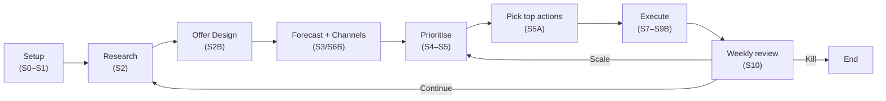

# Startup Loop: What to do next for HEAD, PET, and BRIK

## 1) Purpose

This page tells you what to do next for HEAD, PET, and BRIK — and how to do it.

## Open tasks (updated 2026-02-17)

Use these ranked lists to pick your next action. Tasks are ordered — complete from top to bottom, as each one unlocks the next.

### HEAD

| # | Task | Why this comes first | Done when |
|---|---|---|---|
| 1 | Fill Operational Confirmations (6 fields): in-stock date, units, pricing, compatibility, payment readiness, returns SLA | Nothing else for HEAD can advance until these are confirmed. The forecast, offer design, and channel selection all depend on known inventory and operational reality. | All 6 fields confirmed and timestamped. |
| 2 | Complete Pre-website Measurement Setup | HEAD is pre-website. Paid traffic without GA4, Search Console, and conversion event setup produces data you cannot use. | Measurement setup document at Active status. |
| 3 | Produce the HEAD offer artifact (S2B) | Requires the operational inputs from task 1. Without the offer, the forecast and channel plan have no anchor. | Offer artifact exists with target customer profile, positioning, and pricing model. |
| 4 | Advance HEAD forecast to decision-grade (S3) | A draft forecast exists from 12 Feb based on assumptions. Rebuild it once operational inputs are confirmed. | Forecast document at Active status with confirmed inputs replacing assumptions. |
| 5 | Run this week's K/P/C/S decision | First decision is dated 12 Feb. The loop loses signal without weekly continuation. | This week's decision document exists and is dated. |
| 6 | Run standing refresh | No market-pulse, channel-economics, or regulatory-watch documents exist yet for HEAD. | At least one standing refresh document produced and dated. |

### PET

| # | Task | Why this comes first | Done when |
|---|---|---|---|
| 1 | Confirm inventory inputs: units on hand, expected arrival date, landed cost per unit | PET forecast cannot reach decision-grade without these three numbers. All other PET planning depends on knowing supply reality. | All three inventory inputs confirmed and documented. |
| 2 | Run a 7-day paid acquisition test | No measured CPC or CVR data exists. The forecast uses seed assumptions only — replace them with a real data point. | First measured CPC and CVR documented from a 7-day live test. |
| 3 | Complete Pre-website Measurement Setup | Same requirement as HEAD. Measurement must be in place before paid traffic can produce usable data. | Measurement setup document at Active status. |
| 4 | Produce the PET offer artifact (S2B) | Requires inventory inputs (task 1) and measurement setup (task 3). Without the offer, channel and forecast work has no input. | Offer artifact exists with target customer profile, positioning, and pricing model. |
| 5 | Advance PET forecast to decision-grade (S3) | A draft exists from 11 Feb. Rebuild it once inventory is confirmed and acquisition data is captured. | Forecast document at Active status with confirmed inputs replacing assumptions. |
| 6 | Run this week's K/P/C/S decision | First decision is dated 12 Feb. Weekly continuation required. | This week's decision document exists and is dated. |
| 7 | Run standing refresh | No standing refresh documents exist yet for PET. | At least one standing refresh document produced and dated. |

### BRIK

| # | Task | Why this comes first | Done when |
|---|---|---|---|
| 1 | Verify GA4 standard report signal: open Standard Reports (not Realtime), check begin_checkout and web_vitals for last 7 days | Weekly decisions depend on confirmed non-zero signal in 7-day standard reports. If either event shows zero, all downstream measurement is unreliable. | Non-zero begin_checkout and web_vitals confirmed in standard 7-day GA4 report, findings documented. |
| 2 | Run day-14 forecast recalibration | Forecast v1 from 13 Feb is based on seed assumptions. Replace them with measured week 1/2 actuals before making scale decisions. | Recalibration document exists with measured actuals replacing seed inputs. |
| 3 | Produce the BRIK offer artifact (S2B) | BRIK has not completed offer design. Channel strategy and refined forecasting both require it. | Offer artifact exists with target customer profile, positioning, and pricing model. |
| 4 | Run Channel Strategy (S6B) | No BRIK channel plan yet. Requires the offer artifact from task 3. | Channel plan exists with 2-3 selected channels and a 30-day GTM timeline. |
| 5 | Run this week's K/P/C/S decision | First decision is dated 13 Feb. Weekly continuation required. | This week's decision document exists and is dated. |
| 6 | Run standing refresh | No standing refresh documents exist yet for BRIK. | At least one standing refresh document produced and dated. |

## The Loop in 8 steps

Every week you run the same eight steps — gather data, design your offer, forecast, prioritise, act, then review — so the business gets sharper each time round.



Each week the S10 review gives you one of three verdicts: Continue (loop back to Research and sharpen your data), Scale (jump straight to Prioritise with what you already know), or Kill (end the business and move on). The loop is designed to be fast — most businesses complete the full first pass in 2–4 weeks.

## Tasks by theme

The same open tasks as above, grouped by type for when you want to tackle one theme across all three businesses at once.

### Measurement setup
- **HEAD** — Complete Pre-website Measurement Setup (GA4 + Search Console + conversion events).
- **PET** — Complete Pre-website Measurement Setup (same requirement as HEAD).
- **BRIK** — Verify GA4 standard report signal: check begin_checkout and web_vitals in standard 7-day reports (not Realtime).

### Operational confirmations
- **HEAD** — Fill Operational Confirmations: in-stock date, units, pricing, compatibility, payment flow readiness, returns SLA.
- **PET** — Confirm inventory inputs: units on hand, expected arrival date, landed cost per unit.

### Acquisition data
- **PET** — Run a 7-day paid acquisition test to capture the first measured CPC and CVR.

### Forecasting
- **HEAD** — Advance forecast to decision-grade once operational inputs are confirmed (rebuild the 12 Feb draft).
- **PET** — Advance forecast to decision-grade once inventory and acquisition data are captured (rebuild the 11 Feb draft).
- **BRIK** — Run day-14 forecast recalibration: replace seed assumptions with measured week 1/2 actuals.

### Offer and channel design
- **HEAD** — Produce offer artifact: target customer profile, positioning, pricing model.
- **PET** — Produce offer artifact: target customer profile, positioning, pricing model.
- **BRIK** — Produce offer artifact, then produce channel strategy (S6B) with 2-3 launch channels and a 30-day GTM plan.

### Weekly cadence
- Run the K/P/C/S decision for each business this week. Last completed: HEAD 12 Feb, PET 12 Feb, BRIK 13 Feb.

### Standing refresh (cross-cutting)
- No standing refresh documents exist yet for any business. Produce at minimum: one market-pulse document, one channel-economics-refresh document.

## Stage status

When each stage was last completed per business. **Draft** means the artifact exists but is not yet decision-grade. **Never** means the stage has not been run. **N/A** means the stage does not apply to that business.

| Stage | What you provide | What happens | What comes out | Why it matters | HEAD | PET | BRIK |
|---|---|---|---|---|---|---|---|
| **S0 — Intake** | Business idea, product spec, constraints | Turns raw input into structured startup context | Intake packet | Everything else depends on this | Feb 12 ✓ | Feb 12 ✓ | Feb 12 ✓ |
| **S1 — Readiness** | Strategy plan, people profile | Checks 7 gates; identifies blockers | Readiness report + blocker list | Tells you what is missing before you spend time on research | Feb 12 ✓ | Feb 12 ✓ | Never |
| **S1B — Measurement setup** *(pre-website only)* | Launch surface confirmed as pre-website | Sets up analytics before any traffic | Measurement setup document | You cannot measure what you cannot track | **Never** | **Never** | Feb 13 ✓ |
| **S2A — Historical baseline** *(website-live only)* | Net value exports, booking data, traffic logs | Consolidates business history into a decision baseline | Historical baseline document | Existing businesses cannot forecast without knowing where they started | N/A | N/A | Feb 12 ✓ |
| **S2 — Market intelligence** | Intake packet, baseline (if existing) | Researches competitors, demand, pricing, and channels | Market intelligence pack | Your offer and forecast are guesses without market data | Feb 12 ✓ | Feb 12 ✓ | Feb 15 ✓ |
| **S2B — Offer design** | Market intel, intake packet | Defines target customer, positioning, and pricing model | Offer artifact | Without an offer, there is nothing to forecast or sell | **Never** | **Never** | **Never** |
| **S3 — Forecast** | Offer artifact, market intel | Builds P10/P50/P90 revenue scenarios with guardrails | 90-day forecast document | Tells you what success looks like so you know when to pivot | Feb 12 (draft) | Feb 11 (draft) | Feb 13 ✓ |
| **S3 — Recalibration** | Week 1/2 measured actuals | Replaces seed assumptions with real data | Recalibration document | Seed-assumption forecasts go stale; recalibrate at day 14 | **Never** | **Never** | **Never** |
| **S6B — Channel strategy** | Offer artifact, market intel, valid DEP (GATE-S6B-STRAT-01); measurement verified before spend (GATE-S6B-ACT-01) | Selects 2-3 launch channels with 30-day GTM plan | Channel plan + SEO strategy | Without a channel plan, you are guessing where to spend | **Never** | **Never** | **Never** |
| **S4/S5 — Prioritise** | Offer + forecast + channels | Scores and ranks actions by impact | Prioritised action list | Stops you working on the wrong thing | Feb 12 ✓ | Feb 12 ✓ | Feb 13 ✓ |
| **S6 — Site upgrade** | Prioritised list, platform baseline | Builds upgrade backlog from best-of analysis | Site upgrade brief | Turns competitor observations into a concrete improvement plan | Feb 12 ✓ | Feb 12 ✓ | Feb 13 ✓ |
| **S10 — Weekly decision** | This week's KPIs and gate checks | Runs Keep/Pivot/Scale/Kill decision | Weekly K/P/C/S decision document | Loop health degrades within days without the weekly decision | Feb 12 ✓ | Feb 12 ✓ | Feb 13 ✓ |
| **Standing refresh** | Time passing (monthly/quarterly cadence) | Refreshes market, channel, and regulatory inputs | Market-pulse + channel-economics + regulatory-watch documents | Inputs go stale; decisions based on stale data are dangerous | **Never** | **Never** | **Never** |

## Readiness check

Before investing time in the next stage, answer these six questions. Each one is a yes/no check. A 'No' means you have work to do first — see the action cards above.

1. Is the offer defined clearly enough to test with real customers?
2. Is measurement set up and producing real data?
3. Do we have baseline data to compare against? *(existing businesses only — skip if you are pre-launch)*
4. Do we have inventory and cost inputs to build a reliable forecast?
5. Have we chosen our 2–3 launch channels and do we have a plan for each?
6. Have we selected and scored the top 2–3 things to work on next?

> **Note for engineers:** The full gate specification (RG-01 through RG-07) with acceptance criteria and evidence paths is preserved verbatim in the Engineering appendix below.

> **Capability contract:** The canonical marketing/sales capability registry — defining the seven capabilities required for decision-grade marketing and sales infrastructure — is at `docs/business-os/startup-loop/marketing-sales-capability-contract.md`.

> **Forecast guardrail contract:** S3 forecast outputs must apply a confidence tier (low/medium/high) that controls spend cap, operator time cap, re-check cadence, and allowed decision class. Unknown confidence defaults to `low` tier (10% spend cap, ≤5 hrs/week/channel, Continue/Investigate only). Full tier table and assumption register requirements (9 mandatory fields including `kill_trigger`, `owner`, `next_review_date`) are defined in `.claude/skills/lp-forecast/SKILL.md` (§ Forecast Guardrails).

> **S10 denominator validity contract:** Weekly K/P/C/S decisions require denominator validity checks before issuing Scale or Kill. Five KPI families have explicit minimum denominators (Traffic trend ≥200 sessions/week; Lead CVR ≥100 visits + 10 leads; Booking/Purchase CVR ≥150 visits + 8 orders; CAC ≥10 conversions; Revenue/AOV ≥10 orders). If any selected KPI fails its threshold, the decision class is restricted to `Continue` or `Investigate` — `Scale` and `Kill` require all relevant denominators to pass. Full table in `docs/business-os/workflow-prompts/_templates/weekly-kpcs-decision-prompt.md` (§ KPI Denominator Minimums) and `.claude/skills/lp-launch-qa/SKILL.md` (§ KPI Denominator Validity).

> **Bottleneck profile adapter contract:** S10 bottleneck diagnosis is business-model-aware when `business_model_profile` is set on the run context. Two profiles are supported: `hospitality-direct-booking` (adds `inquiry_to_quote_rate`, `quote_to_booking_rate`, `median_response_time`, `direct_ota_mix`, `cancellation_rate`, `review_velocity`) and `dtc-ecommerce` (adds `page_to_atc_rate`, `checkout_completion_rate`, `cac_by_cohort`, `refund_rate`, `support_load_per_100_orders`, `repeat_purchase_rate`). Profile primary primitives compete with base catalog metrics by miss magnitude; profile secondary derived metrics are deprioritised when a profile primary has severity ≥ moderate. Existing v1 snapshots without a profile remain valid. Full schema and examples in `docs/business-os/startup-loop/bottleneck-diagnosis-schema.md` (§§ 2A, 5, 11).

## Business Operator Actions

These are the actions owned by Pete as venture-studio operator. Each row is a concrete next step — not a platform task.

| Action | Why it matters | Done when |
|---|---|---|
| Fill the Operational Confirmations form for HEAD | HEAD 90-day forecast cannot reach decision-grade without stock date, units, pricing, compatibility, payment readiness, and returns SLA. | All 6 fields confirmed and timestamped. |
| Fill the Operational Confirmations form for PET (inventory + costs) | PET forecast is not decision-grade without real inventory units, arrival date, and landed cost. | Inventory confirmed: units, arrival date, landed cost per unit all captured. |
| Run a 7-day paid acquisition test for PET | PET has no measured CPC or CVR yet — the forecast relies on seed assumptions until real data is captured. | First measured CPC and CVR documented from a 7-day live test. |
| Verify GA4 standard report signal for BRIK (begin_checkout + web_vitals) | The weekly BRIK decision loop needs confirmed non-zero signal in 7-day standard reports, not just realtime. | Non-zero begin_checkout and web_vitals in standard 7-day GA4 report. |
| Run the day-14 forecast recalibration for BRIK | BRIK v1 forecast is based on seed assumptions; first two weeks of measured data must replace them for reliable scaling decisions. | Day-14 recalibration document produced and integrated into the BRIK strategy plan. |
| Complete the Pre-website Measurement Setup checklist for HEAD | HEAD is pre-website; paid traffic cannot start without GA4, Search Console, and conversion event setup. | Measurement setup document at Active status. |
| Complete the Pre-website Measurement Setup checklist for PET | PET is pre-website; same measurement requirement as HEAD. | Measurement setup document at Active status. |
| Run the weekly K/P/C/S decision for each active business | Loop health depends on weekly cadence — decisions go stale within days without the weekly review. | Weekly K/P/C/S decision document produced and dated this week. |
| Run standing refresh prompts when cadence triggers | Market/channel/regulatory inputs go stale without periodic refresh. | Monthly market-pulse, channel-economics, and quarterly regulatory-watch documents up to date. |

## Per-business action cards

These cards tell you exactly what to do for each business. Each step is actionable — no code knowledge or repository access required.

### HEAD card

**Title:** Confirm HEAD operations

**Why it matters:** The HEAD 90-day forecast cannot become decision-grade until six operational inputs are confirmed. Without them, any planning and investment decision rests on assumptions.

1. Confirm the in-stock date — when will the product physically be available to ship?
2. Confirm sellable units — how many units are available at launch?
3. Confirm pricing and any bundle options.
4. Provide the compatibility matrix — which devices/platforms does the product work with?
5. Confirm the payment flow is ready to accept orders.
6. Define the returns policy and SLA (how long does a return take?).

**Done when:** All six fields are filled in and timestamped. The Operational Confirmations form shows complete status.

---

### PET card

**Title:** Confirm PET supply and run first acquisition test

**Why it matters:** The PET forecast is not decision-grade without real inventory data and at least one measured acquisition data point. Seed assumptions are not enough to make a confident investment decision.

1. Confirm inventory units — how many units are on hand or on order?
2. Confirm the expected arrival date for the inventory.
3. Confirm the landed cost per unit (total cost including shipping, duties, and fees).
4. Run a small paid acquisition test for 7 days (any channel — Meta, Google, TikTok).
5. Record the observed cost per click (CPC) and conversion rate (CVR) from the test.

**Done when:** All inventory inputs confirmed. First measured CPC and CVR captured. Forecast document updated to decision-grade.

---

### BRIK card

**Title:** Restore GA4 measurement signal

**Why it matters:** The weekly BRIK decision loop depends on non-zero signal from two GA4 events (begin_checkout and web_vitals) in standard 7-day reports. If these show zero, the weekly cadence cannot produce reliable data.

1. Open Google Analytics 4 → go to Standard Reports (NOT the Realtime section).
2. Navigate to Engagement → Events.
3. Set the date range to the last 7 days.
4. Check whether begin_checkout shows a non-zero count.
5. Check whether web_vitals shows a non-zero count.
6. If either is zero: open GA4 DebugView, open a live browser session on the site, and check whether the events fire during a real checkout attempt.
7. Document your findings — what you saw and whether it resolved.

**Done when:** Non-zero begin_checkout and web_vitals confirmed in standard 7-day GA4 report. Document saved. Then proceed to the day-14 forecast recalibration.

## If you have 10/30/60 minutes

Already familiar with the loop? Use this guide to decide what to work on today based on the time you have.

### 10 minutes — Check status and pick one action

- Read the Today panel for the business you want to move forward.
- Identify the single top blocker.
- Complete one concrete step toward that blocker: fill a field in the Operational Confirmations form, run a 5-minute GA4 check, or confirm one inventory number.
- Done: you have moved at least one blocker forward.

### 30 minutes — Complete a full checklist

- Pick one of these and run it end-to-end:
  - **GA4 measurement verification for BRIK** — open Standard Reports, check begin_checkout and web_vitals for last 7 days, run DebugView if needed, document outcome.
  - **Operational Confirmations for HEAD or PET** — fill all 6 required fields in the form and timestamp them.
  - **Baseline refresh review** — check whether any standing refresh prompt (market pulse, channel economics) is overdue and queue it.
- Done: the chosen checklist is complete and documented.

### 60 minutes — Produce a required artifact

- Pick one of these artifacts and produce it:
  - **Day-14 forecast recalibration** — update the BRIK 90-day forecast using measured week-1/2 actuals to replace seed assumptions.
  - **Weekly K/P/C/S decision** — run the weekly Keep/Pivot/Scale/Kill review for HEAD, PET, or BRIK and produce the decision document.
  - **Complete action card** — pick one business, work through all steps in its action card, and mark it done.
- Done: the artifact exists and is dated today.

## Quick Actions by stage

Use this table to find the right action for each stage. For prompt file paths and output paths, see the Engineering appendix.

| When you are at | What to do | Done when |
|---|---|---|
| Starting a new business or major scope shift (S0) | Run the Intake Normaliser prompt for this business | Intake packet exists for the business |
| Readiness check shows a block or warning (S1) | Run the Blocker Interview prompt to identify what is missing | Blocker interview document exists; all blockers have an owner and a deadline |
| Business is pre-website and measurement is not set up (S1B) | Run the Pre-website Measurement Setup checklist | Measurement setup document is at Active status |
| Business is website-live and historical baseline is missing or blocked (S2A) | Run the Historical Data Request prompt to identify what data is needed | Data request document sent to the data owner |
| Required S2A data pack has arrived | Run the Historical Baseline Consolidation prompt | Historical baseline document is at Active status |
| Market intelligence is missing, stale, or points to a Draft (S2) | Run the Deep Research: Market Intelligence prompt | Market intelligence document is at Active status with a valid latest pointer |
| Week-1/2 actuals are available or a major assumption has broken (S3) | Run the Forecast Recalibration prompt | Forecast recalibration document exists and is dated |
| 3 or more candidate actions are competing for priority (S5) | Run the Prioritisation Scorer prompt | Prioritisation scorecard exists with top 2–3 items ranked |
| Site upgrade brief is missing, stale, or points to a Draft (S6) | Run the Deep Research: Site Upgrade prompt | Site upgrade brief is at Active status with a valid latest pointer |
| It is the weekly cadence checkpoint (S10) | Run the Weekly K/P/C/S Decision prompt | This week's K/P/C/S decision document is dated and saved |

> **For prompt paths and output paths:** See the Engineering appendix → Prompt Hand-Off Map section.

## Engineering appendix

## Platform Engineering Actions

These are platform and engineering tasks. They are not required from the operator — they are tracked here for visibility.

| Action | Why it matters | Done when |
|---|---|---|
| Resolve MCP identity/deployment decision (TASK-05 in MCP plan) | Guarded BOS write rollout cannot proceed safely until the identity and deployment model is confirmed. | Decision documented and the MCP plan TASK-05 marked complete. |
| Complete MCP guarded BOS write rollout (TASK-06 in MCP plan) | S5B/S7/S8/S9/S10 write paths need governed MCP write capability before BOS can be fully operationalised. | MCP guarded-write end-to-end test passes; TASK-06 marked complete. |
| Implement wave-2 measure_* MCP connectors | S2A/S3/S10 measurement stages need normalised cross-source measurement contracts — GA4, Search Console, and Cloudflare data accessible via MCP tools. | Wave-2 connector fact-find brief exists; at least one connector implemented and validated. |
| Automate Octorate Batch 1 (booking value) data collection | BRIK historical baseline currently relies on manual Batch 1 extraction — automation reduces refresh friction. | Automated extraction produces a valid booking value dataset matching the manual baseline format. |

> **Note for engineers:** The original "Open Tasks" table (with evidence paths and stage codes) is preserved verbatim in the Engineering appendix below.

## Data Flow Reference [Engineering Reference]

The detailed stage-by-stage data flow (inputs, processing, outputs) is captured in the **Stage-by-Stage Workflow** table below. Artifact paths and lifecycle notes are in the artifact front-matter under `docs/business-os/startup-baselines/`, `docs/business-os/strategy/`, and `docs/business-os/market-research/`.

## Website Upgrade Sub-Loop [Engineering Reference]


This sub-loop feeds the main startup loop at the lp-fact-find stage.

## Stage-by-Stage Workflow [Engineering Reference]

Canonical source: `docs/business-os/startup-loop/loop-spec.yaml` (spec_version 1.1.0).

| Stage | Inputs | Processing | Outputs |
|---|---|---|---|
| S0. Intake | Business idea, product spec, channels, constraints, stock timeline | Normalize raw user intent into structured startup context | Intake packet per business |
| S1. Readiness preflight | Strategy plan, people profile, path-business mapping, prior cards/ideas | Run readiness gates (`RG-01..RG-07`) and detect blockers | Readiness report + missing-context register + blocker questions/prompts |
| S1B. Pre-website measurement bootstrap (conditional: pre-website) | Launch-surface mode = `pre-website` + intake packet + business plan | Run mandatory analytics/measurement setup gate and operator handoff (GA4/Search Console/API prereqs) | Measurement setup note + verification checklist + blocker list |
| S2A. Historical performance baseline (conditional: website-live) | Monthly net booking value exports + Cloudflare analytics + ops logs + Octorate data collection (Batch 1: booking value, Batch 2: calendar/inventory) | Consolidate internal history into decision baseline with data-quality notes | Historical baseline pack (`Status: Active` required before S2/S6 for existing businesses) + Octorate data collection protocol active |
| S2. Market intelligence | Deep Research prompt template + business intake packet (+ S2A baseline for existing businesses) | Competitor/demand/pricing/regulatory research, confidence tagging | Market Intelligence Pack per business + `latest` pointer |
| S2B. Offer design | Market intelligence + intake packet + constraints | Consolidate ICP, positioning, pricing, offer design into validated hypothesis | Offer artifact (`/lp-offer` output); BD-3 sub-deliverable: messaging-hierarchy.user.md (Draft minimum required before S2B is Done — GATE-BD-03) |
| *S3. Forecast* (parallel with S6B) | Business intake + fresh market intelligence + offer hypothesis | Build P10/P50/P90 forecast, guardrails, assumptions, 14-day tests | Forecast doc + exec summary + forecast seed |
| *S6B. Channel strategy + GTM* (parallel with S3) | Offer hypothesis + market intelligence + valid DEP (GATE-S6B-STRAT-01 must pass before design begins; GATE-S6B-ACT-01 must pass before spend commitment) | Channel-customer fit analysis, 2-3 launch channels, 30-day GTM timeline | Channel plan + SEO strategy + outreach drafts |
| S4. Baseline merge (join barrier) | Offer (S2B) + forecast (S3) + channels (S6B) | Validate required upstream artifacts; compose deterministic baseline snapshot | Candidate baseline snapshot + draft manifest |
| S5A. Prioritize (no side effects) | Baseline snapshot + forecast + constraints | Score and rank go-item candidates | Prioritized backlog candidates (pure ranking, no persistence) |
| S5B. BOS sync (sole mutation boundary) | Prioritized items from S5A | Persist cards/stage-docs to D1; commit manifest pointer as current | BOS cards created/updated + manifest committed |
| S6. Website upgrade synthesis | Platform baseline + business upgrade brief + reference sites | Best-of decomposition and fit matrix (Adopt/Adapt/Defer/Reject) | Fact-find-ready website backlog packet |
| S7. Fact-find | Chosen go-item(s), evidence docs, constraints | Deep evidence audit and task seeds | Fact-find brief (`Ready-for-planning` or `Needs-input`) |
| S8. Plan | Fact-find brief | Confidence-gated implementation plan | Plan doc with tasks/VCs/checkpoints |
| S9. Build | Approved plan tasks | Implement + validate + track outputs | Shipped work + validation evidence |
| S9B. QA gates | Build outputs + design spec + performance budget | Launch QA, design QA, measurement verification | QA report + go/no-go recommendation |
| S10. Weekly decision loop | KPI scoreboard + gate metrics + costs + operational reliability + growth ledger outputs (`stage_statuses`, `overall_status`, `guardrail_signal`, `threshold_set_hash`) | K/P/C/S decisioning + replayability check against growth event payload | Continue/Pivot/Scale/Kill decision + linked growth artifacts (`stages/S10/stage-result.json`, `data/shops/{shopId}/growth-ledger.json`, `stages/S10/growth-event-payload.json`) + loop-back updates |

**Brand & Design touch-points (cross-cutting, enforced by advance gates):**

| Touch-point | Trigger | Processing | Output / Gate |
|---|---|---|---|
| BD-1 Brand Dossier bootstrap | S1 advance | GATE-BD-01 (Hard): check brand-dossier.user.md Draft/Active status in strategy index; block S1 advance if missing | Run `/lp-brand-bootstrap <BIZ>` → `brand-dossier.user.md` at Draft minimum |
| BD-2 Competitive Positioning | After S2 | Competitive positioning research via BRAND-DR-01/02 prompts | `competitive-positioning.user.md`; evidence pack entries under `docs/business-os/evidence/<BIZ>/` |
| BD-3 Messaging Hierarchy (S2B sub-deliverable) | S2B completion | GATE-BD-03 (Hard): messaging-hierarchy.user.md must exist at Draft minimum before S2B is Done | `messaging-hierarchy.user.md` at Draft minimum; S2B not Done without it |
| BD-4 Creative Voice Brief | After S6B | Creative voice brief derived from channel angles and messaging decisions (BRAND-DR-04) | `creative-voice-brief.user.md` |
| BD-5 Design Spec gate | S7/S8 (lp-design-spec pre-flight) | GATE-BD-07 (Hard): lp-design-spec requires Active brand-dossier; blocks design spec if Status ≠ Active | Gate pass → lp-design-spec runs; gate block → advance brand-dossier to Active first |
| BD-6 Brand Copy QA | S9B (`/lp-launch-qa`) | Domain 5 Brand Copy Compliance checks: BC-04 (words-to-avoid), BC-05 (claims in messaging hierarchy), BC-07 (voice audit) | Brand compliance verdict in QA report; pass required for go-live |

## Current Missing Information (HEAD, PET, and BRIK) [Engineering Reference]

### 5.1 Cross-cutting blockers (impact HEAD, PET, and BRIK)

| Missing item | Type | Why it blocks | Current evidence |
|---|---|---|---|
| Standing refresh outputs not yet started | Input freshness risk (Periodic) | Prompt templates exist, but no recurring refresh artifacts are persisted yet | No `market-pulse`, `channel-economics-refresh`, or `regulatory-claims-watch` docs found under `docs/business-os/` |

Resolved recently (no longer missing):
- Platform baseline is active: `docs/business-os/platform-capability/latest.user.md`.
- Market intelligence packs are active for HEAD and PET:
  - `docs/business-os/market-research/HEAD/latest.user.md`
  - `docs/business-os/market-research/PET/latest.user.md`
- BRIK market intelligence pack is active (decision-grade):
  - `docs/business-os/market-research/BRIK/latest.user.md`
- HEAD site-upgrade brief is active:
  - `docs/business-os/site-upgrades/HEAD/latest.user.md`
- PET site-upgrade brief is active:
  - `docs/business-os/site-upgrades/PET/latest.user.md`
- BRIK site-upgrade brief is active (decision-grade):
  - `docs/business-os/site-upgrades/BRIK/latest.user.md`
- Intake packets are active for HEAD and PET:
  - `docs/business-os/startup-baselines/HEAD-intake-packet.user.md`
  - `docs/business-os/startup-baselines/PET-intake-packet.user.md`
- Intake packet is active for BRIK:
  - `docs/business-os/startup-baselines/BRIK-intake-packet.user.md`
- Readiness mapping gate now passes for active scope:
  - `docs/business-os/readiness/2026-02-12-idea-readiness.user.md` (`Run-Status: warning`)
- Blocker interview packs are active for HEAD and PET:
  - `docs/business-os/readiness/2026-02-12-HEAD-blocker-interview.user.md`
  - `docs/business-os/readiness/2026-02-12-PET-blocker-interview.user.md`
- Outcome contracts are now locked in canonical plans:
  - `docs/business-os/strategy/HEAD/plan.user.md`
  - `docs/business-os/strategy/PET/plan.user.md`
  - `docs/business-os/strategy/BRIK/plan.user.md`
- Prioritization scorecards are active for HEAD, PET, and BRIK:
  - `docs/business-os/strategy/HEAD/2026-02-12-prioritization-scorecard.user.md`
  - `docs/business-os/strategy/PET/2026-02-12-prioritization-scorecard.user.md`
  - `docs/business-os/strategy/BRIK/2026-02-13-prioritization-scorecard.user.md`
- Weekly K/P/C/S decision logs have started for HEAD, PET, and BRIK:
  - `docs/business-os/strategy/HEAD/2026-02-12-weekly-kpcs-decision.user.md`
  - `docs/business-os/strategy/PET/2026-02-12-weekly-kpcs-decision.user.md`
  - `docs/business-os/strategy/BRIK/2026-02-13-weekly-kpcs-decision.user.md`

### 5.2 HEAD-specific gaps

| Stage | Missing information | Gap type | Evidence |
|---|---|---|---|
| S1 Readiness | Demand/conversion baselines still not measured | Input missing | `docs/business-os/strategy/HEAD/plan.user.md` metrics section |
| S3 Forecast | Region/tax still unresolved in some active decision docs (`Region: TBD`) | Input/consistency gap | `docs/business-os/strategy/HEAD/2026-02-11-week2-gate-dry-run.user.md`, `docs/business-os/strategy/HEAD/launch-readiness-action-backlog.user.md` |
| S3 Forecast | Key operational confirmations missing: in-stock date, sellable units, price architecture, compatibility matrix, payment readiness, returns SLA | Input missing | `docs/business-os/startup-baselines/HEAD-forecast-seed.user.md` section "Still missing / needs confirmation" |
| S3 Forecast | No post-launch recalibration artifact exists yet | Output missing | No `docs/business-os/strategy/HEAD/*-forecast-recalibration.user.md` |
| S4 Baseline merge | Baseline exists but remains draft and not yet promoted into canonical strategy outcome contract | Output not integrated | `docs/business-os/startup-baselines/HEAD-forecast-seed.user.md` + `docs/business-os/strategy/HEAD/plan.user.md` |

### 5.3 PET-specific gaps

| Stage | Missing information | Gap type | Evidence |
|---|---|---|---|
| S1 Readiness | Demand/margin baselines not measured in canonical plan | Input missing | `docs/business-os/strategy/PET/plan.user.md` metrics section |
| S3 Forecast | Forecast is not decision-grade until inventory units/arrival, real costs, and observed CPC/CVR are captured | Input missing | `docs/business-os/strategy/PET/italy-90-day-launch-forecast-v2.user.md` section "Required Data to Upgrade v2 -> Decision-Grade" |
| S3 Forecast | No post-launch recalibration artifact exists yet | Output missing | No `docs/business-os/strategy/PET/*-forecast-recalibration.user.md` |
| S4 Baseline merge | PET baseline now exists but remains draft and not yet promoted into canonical strategy outcome contract | Output not integrated | `docs/business-os/startup-baselines/PET-forecast-seed.user.md` + `docs/business-os/strategy/PET/plan.user.md` |

### 5.4 BRIK-specific gaps

| Stage | Missing information | Gap type | Evidence |
|---|---|---|---|
| S1 Readiness | Outcome contract is now in canonical startup-loop format; maintain weekly refresh against measured data | Freshness/cadence risk | `docs/business-os/strategy/BRIK/plan.user.md`; `docs/business-os/startup-baselines/BRIK-forecast-seed.user.md` |
| S1 Readiness | First 7-day measured baseline is now locked (sessions/users/page_view); conversion and vitals signals remain zero in current window | Signal-quality gap | `docs/business-os/strategy/BRIK/plan.user.md` metrics section; `docs/business-os/strategy/BRIK/2026-02-13-measurement-verification.user.md` |
| S2A Historical baseline | Baseline is active; Octorate data collection protocol established with Batch 2 (calendar/inventory) fully automated; Batch 1 (booking value) requires automation; Cloudflare proxies are partial (11/24 months request totals only; no page/geo/device splits) and older months are unavailable under current access | Data quality + automation gap | `docs/business-os/strategy/BRIK/2026-02-12-historical-performance-baseline.user.md` (`Status: Active`); `docs/business-os/strategy/BRIK/2026-02-14-octorate-operational-data-baseline.user.md` (`Status: Active`); `docs/business-os/startup-loop/octorate-data-collection-protocol.md` (`Status: Active`); `docs/business-os/strategy/BRIK/data/cloudflare_monthly_proxies.csv`; `docs/business-os/strategy/BRIK/data/data_quality_notes.md` |
| S2A Measurement setup | Data API access is enabled, first extract is captured, and production click-path now verifies live `begin_checkout` collection after deployment alignment; `web_vitals` verification and refreshed report-window confirmation remain pending | Signal-quality/verification gap | `docs/business-os/strategy/BRIK/2026-02-13-measurement-verification.user.md`; `docs/business-os/strategy/BRIK/plan.user.md`; setup note: `docs/business-os/strategy/BRIK/2026-02-12-ga4-search-console-setup-note.user.md` |
| S2 Market intelligence | Decision-grade pack is now active; enforce monthly freshness + change-trigger refresh | Refresh cadence risk | `docs/business-os/market-research/BRIK/2026-02-12-market-intelligence.user.md` (`Status: Active`); handoff prompt retained at `docs/business-os/market-research/BRIK/2026-02-12-deep-research-market-intelligence-prompt.user.md` |
| S3 Forecasting | Startup-loop forecast artifact is now active (`v1`); first measured-data recalibration remains pending | Refresh/recalibration risk | `docs/business-os/strategy/BRIK/2026-02-13-startup-loop-90-day-forecast-v1.user.md` (`Status: Active`); exec summary: `docs/business-os/strategy/BRIK/2026-02-13-startup-loop-90-day-forecast-v1-exec-summary.user.md` |
| S4 Baseline merge | Forecast seed is active and integrated into canonical plan; next action is controlled refresh/recalibration after measured week-1/2 data | Refresh/recalibration risk | `docs/business-os/startup-baselines/BRIK-forecast-seed.user.md` (`Status: Active`) + `docs/business-os/strategy/BRIK/plan.user.md` |
| S5 Prioritization | Scored prioritization artifact is active; P1-01 routing, baseline lock, and production checkout telemetry deployment alignment are complete, while report refresh verification and P1-02/P1-03 execution remain open | Execution sequencing risk | `docs/plans/brik-ga4-baseline-lock/fact-find.md`; `docs/plans/brik-ga4-baseline-lock/plan.md`; `docs/business-os/strategy/BRIK/2026-02-13-prioritization-scorecard.user.md` (`Status: Active`) |
| S6 Website synthesis | Decision-grade brief is now active; enforce monthly freshness + change-trigger refresh | Refresh cadence risk | `docs/business-os/site-upgrades/BRIK/2026-02-12-upgrade-brief.user.md` (`Status: Active`); handoff prompt retained at `docs/business-os/site-upgrades/BRIK/2026-02-12-deep-research-site-upgrade-prompt.user.md` |
| S10 Weekly decision loop | First weekly decision artifact is now active; maintain strict weekly cadence and link to gate evidence | Cadence risk | `docs/business-os/strategy/BRIK/2026-02-13-weekly-kpcs-decision.user.md` (`Status: Active`) |

## Current State Snapshot by Stage [Engineering Reference]

| Stage | HEAD | PET | BRIK |
|---|---|---|---|
| S0 Intake | Canonical intake packet active | Canonical intake packet active | Canonical intake packet active |
| S1 Readiness | Mapping gate clear; business-level outcome/metrics gaps remain | Mapping gate clear; business-level outcome/metrics gaps remain | Mapping gate clear; outcome contract normalized, but measured baseline metrics remain incomplete |
| S2A Historical baseline | Not required (startup mode) | Not required (startup mode) | Baseline active with partial Cloudflare coverage; GA4/Search Console core setup verified, event-level verification pending |
| S2 Market intelligence | Active canonical output (`latest` active) | Active canonical output (`latest` active) | Active canonical output (`latest` active; decision-grade) |
| S2B Offer design | Not yet started | Not yet started | Not yet started |
| S3 Forecast | v2 + market-intelligence inputs exist; still needs operational confirmations | v2 + market-intelligence inputs exist; still not decision-grade without observed data | Startup-loop forecast artifact active (`v1`); recalibration pending after first 14-day measured window |
| S6B Channel strategy + GTM | Not yet started | Not yet started | Not yet started |
| S4 Baseline merge | Draft seed exists (pre-merge format) | Draft seed exists (pre-merge format) | Seed active and integrated into canonical plan |
| S5A Prioritize | Scored prioritization artifact active | Scored prioritization artifact active | Scored prioritization artifact active |
| S5B BOS sync | Not yet started | Not yet started | Not yet started |
| S6 Website best-of synthesis | Active brief available | Active brief available | Active brief available (`latest` active; decision-grade) |
| S7 Fact-find handoff quality | Possible but weaker due missing upstream canonical artifacts | Possible but weaker due missing upstream canonical artifacts | Possible with improved quality; still constrained by measurement completeness and S6B artifact gaps |
| S8/S9 Plan/Build | Available in process, but depends on stronger upstream inputs | Available in process, but depends on stronger upstream inputs | Available in process; confidence improved after S2/S3/S4/S5/S6 completion, still constrained by instrumentation completeness |
| S9B QA gates | Not yet started | Not yet started | Not yet started |
| S10 Weekly decision loop | Active weekly decision log started | Active weekly decision log started | Active weekly decision log started |

## Minimal Closure Set [Engineering Reference]

1. HEAD and PET operational confirmations are required (`stock/date/units/price/compatibility/payments/returns SLA`).
2. HEAD and PET forecast recalibration artifacts from measured week-1/2 data are required.
3. BRIK GA4 Realtime/DebugView verification for `web_vitals` and `begin_checkout` is required.
4. BRIK weekly baseline refresh is required, with non-zero `begin_checkout`/`web_vitals` signal restoration or explicit root-cause evidence.
5. BRIK S2/S6 Deep Research freshness checks (monthly or on major outcome/ICP/channel/product change) are required.
6. BRIK sustained weekly decision cadence and first measured-data forecast recalibration are required.
7. Standing refresh artifacts (market pulse, channel economics, regulatory watch) are required.
8. `HOLDCO` registration in business catalog is required (taxonomy hygiene item from readiness warning).

## Deep Research Gate (S2 + S6) [Engineering Reference]

### 9.1 Mandatory hand-off rule

When either S2 (market intelligence) or S6 (site-upgrade brief) is in a seed/draft state, the workflow must:

1. Stop progression for that business at the affected stage.
2. Hand the user a ready-to-run Deep Research prompt file (not a template with placeholders).
3. Require Deep Research completion and persistence before continuing downstream stages.

Seed/draft trigger conditions:

- `latest.user.md` is `Missing`, or
- `latest.user.md` points to a source doc with `Status: Draft`, or
- source doc is stale (`Last-reviewed` older than 30 days), or
- major outcome/ICP/channel/product change occurred.

Additional existing-business trigger:

- For `website-live` businesses, if S2A historical baseline is missing, `Draft`, or `Blocked`, S2/S6 must remain blocked.
- If S2A result is `Blocked` due to missing data, hand the user an S2A data-request prompt immediately and pause until data is supplied.

Pre-website measurement trigger:

- For `pre-website` businesses, S2 onward should be treated as `warning` quality unless S1B measurement bootstrap output exists and its verification checklist has passed.
- If S1B output is missing, hand the user the S1B measurement-bootstrap prompt immediately and pause paid-traffic launch planning until completed.

### 9.2 Required operator hand-off message

```text
Deep Research completion is required for {{BIZ}} at stage {{S2|S6}}.

Use this ready-to-run prompt file:
{{PROMPT_FILE_PATH}}

Run Deep Research, then save/replace target output:
{{TARGET_OUTPUT_PATH}}

After saving:
1) Ensure output doc is decision-grade and set Status: Active.
2) Update latest pointer (`latest.user.md`) with source path.
3) Render HTML companion:
   pnpm docs:render-user-html -- {{TARGET_OUTPUT_PATH}}
```

### 9.3 Current required hand-offs (now)

- HEAD S1B pre-website measurement bootstrap:
  - Prompt file: `docs/business-os/workflow-prompts/_templates/pre-website-measurement-bootstrap-prompt.md`
  - Target output: `docs/business-os/strategy/HEAD/<YYYY-MM-DD>-pre-website-measurement-setup.user.md`
- PET S1B pre-website measurement bootstrap:
  - Prompt file: `docs/business-os/workflow-prompts/_templates/pre-website-measurement-bootstrap-prompt.md`
  - Target output: `docs/business-os/strategy/PET/<YYYY-MM-DD>-pre-website-measurement-setup.user.md`
- BRIK S2 market intelligence:
  - Prompt file: `docs/business-os/market-research/BRIK/2026-02-12-deep-research-market-intelligence-prompt.user.md`
  - Target output: `docs/business-os/market-research/BRIK/2026-02-12-market-intelligence.user.md`
- BRIK S6 site-upgrade brief:
  - Prompt file: `docs/business-os/site-upgrades/BRIK/2026-02-12-deep-research-site-upgrade-prompt.user.md`
  - Target output: `docs/business-os/site-upgrades/BRIK/2026-02-12-upgrade-brief.user.md`

### 9.4 Output gate

S2/S6 is complete only when:

- Target doc status is `Active` (not `Draft`).
- `latest.user.md` points to that active doc.
- HTML companion exists.
- Source list and evidence sections are populated (decision-grade quality bar met).

## Prompt Hand-Off Map (By Stage) [Engineering Reference]

Use this map to decide when the user should be handed a prompt and what output must be produced.

| Stage | Trigger | Prompt template | Required inputs | Required output path |
|---|---|---|---|---|
| S0 Intake | New business/product idea enters loop or major scope shift | `docs/business-os/workflow-prompts/_templates/intake-normalizer-prompt.md` | Raw user idea + product spec + constraints | `docs/business-os/startup-baselines/<BIZ>-intake-packet.user.md` |
| S1 Readiness | Readiness has `block`/`warning` or missing-context register exists | `docs/business-os/workflow-prompts/_templates/readiness-blocker-interview-prompt.md` | latest readiness report + plan + baseline seed | `docs/business-os/readiness/<YYYY-MM-DD>-<BIZ>-blocker-interview.user.md` |
| S1B Pre-website measurement bootstrap | Launch-surface mode is `pre-website` and measurement bootstrap doc is missing/stale | `docs/business-os/workflow-prompts/_templates/pre-website-measurement-bootstrap-prompt.md` | intake packet + business plan + launch-surface mode + runtime/deploy details | `docs/business-os/strategy/<BIZ>/<YYYY-MM-DD>-pre-website-measurement-setup.user.md` |
| S2A-1 Historical data request (existing businesses) | Business is `website-live` and latest baseline is `Blocked` or unavailable fields prevent decision-grade output | `docs/business-os/workflow-prompts/_templates/historical-data-request-prompt.md` (or business-specific handoff prompt file) | blocker summary + required metric list + known source systems | `docs/business-os/strategy/<BIZ>/<YYYY-MM-DD>-historical-data-request-prompt.user.md` |
| S2A-2 Historical baseline consolidation (existing businesses) | Required S2A data pack has been supplied | `docs/business-os/workflow-prompts/_templates/existing-business-historical-baseline-prompt.md` (or business-specific handoff prompt file) | net booking value history + Cloudflare analytics + ops logs | `docs/business-os/strategy/<BIZ>/<YYYY-MM-DD>-historical-performance-baseline.user.md` |
| S2 Market intelligence | `latest.user.md` missing, stale, or points to `Draft`; market conditions changed materially | `docs/business-os/market-research/_templates/deep-research-market-intelligence-prompt.md` (or business-specific handoff prompt file) | intake packet + current constraints + channel intent | `docs/business-os/market-research/<BIZ>/<YYYY-MM-DD>-market-intelligence.user.md` |
| S3 Forecast recalibration | Week-1/2 data available, gate failed, or major assumption breaks | `docs/business-os/workflow-prompts/_templates/forecast-recalibration-prompt.md` | previous forecast + measured KPI data + active constraints | `docs/business-os/strategy/<BIZ>/<YYYY-MM-DD>-forecast-recalibration.user.md` |
| S5 Prioritization | >=3 candidate go-items or conflicting priorities | `docs/business-os/workflow-prompts/_templates/prioritization-scorer-prompt.md` | baseline seed + forecast + constraints + candidate set | `docs/business-os/strategy/<BIZ>/<YYYY-MM-DD>-prioritization-scorecard.user.md` |
| S6 Site upgrade | `latest.user.md` missing, stale, or points to `Draft`; outcome/ICP/channel/product changed | `docs/business-os/site-upgrades/_templates/deep-research-business-upgrade-prompt.md` (or business-specific handoff prompt file) | platform baseline + market intel + plan + baseline seed | `docs/business-os/site-upgrades/<BIZ>/<YYYY-MM-DD>-upgrade-brief.user.md` |
| S10 Weekly decision | Weekly cadence checkpoint | `docs/business-os/workflow-prompts/_templates/weekly-kpcs-decision-prompt.md` | weekly KPI pack + outcome contract + experiment results | `docs/business-os/strategy/<BIZ>/<YYYY-MM-DD>-weekly-kpcs-decision.user.md` |

Output hygiene for every prompt run:

1. Save markdown output at required path.
2. Render HTML companion:
   `pnpm docs:render-user-html -- <output.user.md>`
3. Update relevant `latest.user.md` pointer when applicable.

## Design Policy (Cross-Cutting) [Engineering Reference]

> **Retired.** Design policy and brand decisions have been migrated to first-class artifacts with front matter schemas and gate enforcement.
>
> See:
> - **Brand Dossier (BRIK):** `docs/business-os/strategy/BRIK/brand-dossier.user.md` — audience, personality, visual identity, voice & tone
> - **Prime App Design Branding:** `docs/business-os/strategy/BRIK/prime-app-design-branding.user.md` — Prime-specific design principles, token rationale, signature patterns
> - **Strategy Index (artifact status + gate table):** `docs/business-os/strategy/BRIK/index.user.md`
>
> For HEAD and PET: brand-dossier.user.md is bootstrapped by `/lp-brand-bootstrap <BIZ>` at S1 entry (GATE-BD-01).

### 11.1 BRIK Design Policy (Prime Guest Portal)

→ Migrated to `docs/business-os/strategy/BRIK/prime-app-design-branding.user.md`

### 11.2 HEAD / PET Design Policies

→ Bootstrapped at S1 entry via `/lp-brand-bootstrap <BIZ>`. See `docs/business-os/strategy/<BIZ>/brand-dossier.user.md` once created.

## Standing Refresh Prompts (Periodic) [Engineering Reference]

These are recurring research prompts for standing information refresh.

| Refresh area | Cadence | Trigger | Prompt template | Output path |
|---|---|---|---|---|
| Platform capability baseline | Every 30-45 days | New platform primitives, major app architecture shifts, or stale baseline | `docs/business-os/platform-capability/_templates/deep-research-platform-capability-baseline-prompt.md` | `docs/business-os/platform-capability/<YYYY-MM-DD>-platform-capability-baseline.user.md` |
| Market pulse per business | Monthly | Competitor/offer/channel shifts suspected | `docs/business-os/workflow-prompts/_templates/monthly-market-pulse-prompt.md` | `docs/business-os/market-research/<BIZ>/<YYYY-MM-DD>-market-pulse.user.md` |
| Channel economics refresh | Monthly | CPC/CAC/CVR/returns shift or spend-plan review cycle | `docs/business-os/workflow-prompts/_templates/monthly-channel-economics-refresh-prompt.md` | `docs/business-os/strategy/<BIZ>/<YYYY-MM-DD>-channel-economics-refresh.user.md` |
| Regulatory and claims watch | Quarterly | New policy/compliance/claims risks in target region | `docs/business-os/workflow-prompts/_templates/quarterly-regulatory-claims-watch-prompt.md` | `docs/business-os/strategy/<BIZ>/<YYYY-MM-DD>-regulatory-claims-watch.user.md` |
| Brand Dossier review (GATE-BD-08) | Quarterly (90 days) | GATE-BD-08 (Soft) warning at S10 if Last-reviewed > 90 days; review claim/proof ledger, voice and audience sections | `docs/business-os/workflow-prompts/_templates/brand-claim-proof-validation-prompt.md` (BRAND-DR-03) | Update `docs/business-os/strategy/<BIZ>/brand-dossier.user.md` in-place; bump `Last-reviewed` date |
| `/meta-loop-efficiency` skill audit | Weekly | Any `lp-*` skill file changed, OR >7 days since last audit artifact | `/meta-loop-efficiency` (chat command) | `docs/business-os/platform-capability/skill-efficiency-audit-YYYY-MM-DD-HHMM.md` |

Markdown source artifact contract for standing refresh:

- Collector index path: `docs/business-os/startup-baselines/<BIZ>/runs/<runId>/collectors/content/sources.index.json`
- Markdown artifact path pattern: `docs/business-os/startup-baselines/<BIZ>/runs/<runId>/collectors/content/<sourceId>.md`
- Operators must pass the index path into monthly/quarterly refresh prompts and keep citations aligned to persisted artifacts.

Generic operator hand-off message:

```text
Research refresh required for {{BIZ}}.

Use prompt template:
{{PROMPT_TEMPLATE_PATH}}

Fill placeholders using latest canonical docs for {{BIZ}}.
Use persisted source index:
{{MARKDOWN_SOURCE_INDEX_PATH}}

Save result to:
{{OUTPUT_PATH}}

Then render HTML:
pnpm docs:render-user-html -- {{OUTPUT_PATH}}
```

## Operator Interface [Engineering Reference]

Startup Loop needs a single operator interaction pattern so users do not guess the next step.
Canonical chat wrapper skill: `.claude/skills/startup-loop/SKILL.md`.

### 13.1 Command-style interaction contract

Use this command pattern in agent chat:

1. `/startup-loop start --business <BIZ> --mode <dry|live> --launch-surface <pre-website|website-live>`
2. `/startup-loop status --business <BIZ>`
3. `/startup-loop submit --business <BIZ> --stage <S#> --artifact <path>`
4. `/startup-loop advance --business <BIZ>`

### 13.2 Required run packet (agent response format)

Every `start`, `status`, and `advance` response must return:

| Field | Required value |
|---|---|
| `run_id` | Stable run identifier (`SFS-<BIZ>-<YYYYMMDD>-<hhmm>`) |
| `business` | Target business code (`HEAD`, `PET`, `BRIK`, etc.) |
| `current_stage` | Active stage (`S0..S10`) |
| `status` | `ready` / `blocked` / `awaiting-input` / `complete` |
| `blocking_reason` | Empty if not blocked; explicit gate reason if blocked |
| `next_action` | Exact next user action in one sentence |
| `prompt_file` | Prompt file path when user handoff is required |
| `required_output_path` | Exact output artifact path expected next |
| `bos_sync_actions` | List of required Business OS updates before advancing |

### 13.3 Advance rule

A stage is considered complete only when both are true:

1. Required artifact is written and valid.
2. Required Business OS sync actions are confirmed complete.

If either is missing, the run stays `blocked` at current stage.

**Brand gates enforced on advance (see `.claude/skills/startup-loop/SKILL.md` for full gate definitions):**

- **GATE-BD-01** (Hard): S1 advance blocked until `brand-dossier.user.md` exists at Draft minimum in strategy index.
- **GATE-BD-03** (Hard): S2B completion blocked until `messaging-hierarchy.user.md` exists at Draft minimum in strategy index.
- **GATE-BD-08** (Soft — warning only): S10 emits a staleness warning if brand-dossier `Last-reviewed` > 90 days.

## Business OS Sync Contract (No Loop-to-BOS Drift) [Engineering Reference]

Startup Loop artifacts and Business OS state must move together.

### 14.1 Write-path rule

For cards, ideas, and stage docs:

- Canonical write path is Business OS UI/API (`/api/agent/*`) to D1.
- Do not treat markdown mirror under `docs/business-os/cards/` and `docs/business-os/ideas/` as editable source-of-truth.

Reference:
- `docs/business-os/README.md`
- `docs/business-os/agent-workflows.md`

### 14.2 Stage-to-BOS update matrix

| Stage | Required BOS update | Write path |
|---|---|---|
| S0 Intake | Update business strategy context (intent, scope, constraints) | `docs/business-os/strategy/<BIZ>/plan.user.md` |
| S1 Readiness | Record blockers/warnings and owner actions | `docs/business-os/readiness/<YYYY-MM-DD>-*.user.md` + strategy plan risk section |
| S1B Measurement bootstrap | Record measurement setup status and blockers | `docs/business-os/strategy/<BIZ>/<YYYY-MM-DD>-pre-website-measurement-setup.user.md` |
| S2/S3 Research + Forecast | Update canonical latest pointers and strategy assumptions/targets | `latest.user.md` pointer + `docs/business-os/strategy/<BIZ>/plan.user.md` |
| S5A Prioritize | No BOS sync (pure ranking, no side effects) | n/a |
| S5B BOS sync | Promote selected go-items into Business OS ideas/cards; commit manifest pointer | `POST /api/agent/ideas`, `POST /api/agent/cards` |
| S7 Fact-find | Upsert `fact-find` stage doc for selected card | `GET/PATCH/POST /api/agent/stage-docs/:cardId/fact-find` |
| S8 Plan | Upsert `plan` stage doc + lane transition `Fact-finding -> Planned` | `PATCH /api/agent/cards/:id` + `GET/PATCH/POST /api/agent/stage-docs/:cardId/plan` |
| S9 Build | Upsert `build` stage doc + lane transitions to `In progress`/`Done` | `PATCH /api/agent/cards/:id` + `GET/PATCH/POST /api/agent/stage-docs/:cardId/build` |
| S10 Weekly decision | Record K/P/C/S decision and update card/business plan state | `docs/business-os/strategy/<BIZ>/<YYYY-MM-DD>-weekly-kpcs-decision.user.md` + card updates via API |

### 14.3 Sync guardrails

1. No `advance` when required BOS writes fail.
2. No `advance` when `latest.user.md` pointer is stale for the completed stage.
3. If API write fails, return `blocked` with retry command and exact failing endpoint.
4. Weekly K/P/C/S decision must include links to related card IDs and latest stage docs.
