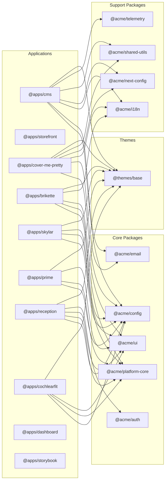

# Package Dependency Graph

This document visualizes the package import boundaries and dependency hierarchy in the base-shop monorepo.

## Layered Architecture Overview

```mermaid
flowchart TB
    subgraph L1["Layer 1: Foundation (No Internal Dependencies)"]
        shared-utils["@acme/shared-utils"]
        i18n["@acme/i18n"]
        zod-utils["@acme/zod-utils"]
        date-utils["@acme/date-utils"]
        design-tokens["@acme/design-tokens"]
        tailwind-config["@acme/tailwind-config"]
    end

    subgraph L2["Layer 2: Configuration & Types"]
        config["@acme/config"]
        types["@acme/types"]
    end

    subgraph L3["Layer 3: Core Business Logic"]
        platform-core["@acme/platform-core"]
        page-builder-core["@acme/page-builder-core"]
        stripe["@acme/stripe"]
    end

    subgraph L4["Layer 4: Domain Services"]
        platform-machine["@acme/platform-machine"]
        auth["@acme/auth"]
        email["@acme/email"]
        email-templates["@acme/email-templates"]
        telemetry["@acme/telemetry"]
        configurator["@acme/configurator"]
        product-configurator["@acme/product-configurator"]
        pipeline-engine["@acme/pipeline-engine"]
    end

    subgraph L5["Layer 5: UI Components"]
        ui["@acme/ui"]
        page-builder-ui["@acme/page-builder-ui"]
        theme["@acme/theme"]
        editorial["@acme/editorial"]
    end

    subgraph L6["Layer 6: Plugins & Integrations"]
        sanity["@acme/sanity"]
        plugin-sanity["@acme/plugin-sanity"]
        plugin-paypal["@acme/plugin-paypal"]
        plugin-premier["@acme/plugin-premier-shipping"]
    end

    subgraph L7["Layer 7: Templates & Scaffolding"]
        templates["@acme/templates"]
        template-app["@acme/template-app"]
        next-config["@acme/next-config"]
    end

    subgraph Themes["Themes (@themes/*)"]
        themes-base["@themes/base"]
        themes-prime["@themes/prime"]
        themes-skylar["@themes/skylar"]
        themes-cochlearfit["@themes/cochlearfit"]
        themes-bcd["@themes/bcd"]
        themes-dark["@themes/dark"]
    end

    %% Layer 2 dependencies
    config --> zod-utils
    types --> i18n

    %% Layer 3 dependencies
    platform-core --> config
    platform-core --> types
    platform-core --> i18n
    platform-core --> date-utils
    platform-core --> shared-utils
    platform-core --> stripe
    platform-core --> page-builder-core
    platform-core --> plugin-sanity
    platform-core --> themes-base
    page-builder-core --> types

    %% Layer 4 dependencies
    platform-machine --> platform-core
    platform-machine --> stripe
    auth --> config
    auth --> platform-core
    email --> config
    email --> platform-core
    email --> i18n
    email --> email-templates
    telemetry --> config

    %% Layer 5 dependencies
    ui --> platform-core
    ui --> config
    ui --> page-builder-core
    ui --> i18n
    ui --> date-utils
    ui --> telemetry
    ui --> types
    ui --> shared-utils
    page-builder-ui --> page-builder-core
    page-builder-ui --> ui

    %% Layer 6 dependencies
    plugin-sanity --> types
    sanity --> plugin-sanity

    %% Themes dependencies
    themes-base --> design-tokens
    themes-prime --> themes-base
    themes-skylar --> themes-base
    themes-cochlearfit --> themes-base
```



## Application Dependencies



## Dependency Rules

### Import Boundaries

| From Layer | Can Import From |
|------------|-----------------|
| Layer 1 (Foundation) | External packages only |
| Layer 2 (Config/Types) | Layer 1 |
| Layer 3 (Core) | Layers 1-2, Themes |
| Layer 4 (Domain) | Layers 1-3 |
| Layer 5 (UI) | Layers 1-4 |
| Layer 6 (Plugins) | Layers 1-3 |
| Layer 7 (Templates) | Layers 1-5 |
| Themes | Layer 1 (design-tokens) |
| Apps | Any package layer |

### Namespace Conventions

| Namespace | Purpose | Location |
|-----------|---------|----------|
| `@acme/*` | Core packages | `packages/*` |
| `@apps/*` | Applications | `apps/*` |
| `@themes/*` | Theme packages | `packages/themes/*` |
| `@auth/*` | Auth types (next-auth) | Virtual (tsconfig paths) |
| `@i18n/*` | i18n data | Virtual (tsconfig paths) |

### Key Dependencies

**Foundation packages** (no workspace dependencies):
- `@acme/shared-utils` - Logging, common utilities
- `@acme/i18n` - Internationalization
- `@acme/zod-utils` - Schema validation helpers
- `@acme/date-utils` - Date formatting utilities
- `@acme/design-tokens` - Design system tokens
- `@acme/tailwind-config` - Tailwind configuration

**Central hub packages** (many dependents):
- `@acme/config` - Environment configuration (17 dependents)
- `@acme/platform-core` - Core business logic (12 dependents)
- `@acme/types` - Type definitions (15 dependents)
- `@acme/ui` - Component library (8 dependents)
- `@themes/base` - Base theme (all storefronts)

## Circular Dependency Prevention

The layered architecture prevents circular dependencies:

1. **Strict layering**: Lower layers cannot import from higher layers
2. **Interface segregation**: Types are defined in `@acme/types`, not in consuming packages
3. **Dependency injection**: `@acme/platform-core` uses DI patterns for plugin integration
4. **Event-based communication**: Cross-cutting concerns use events, not direct imports

## Build Order

Turbo handles build ordering via `dependsOn: ["^build"]`. The effective build order follows the layer hierarchy:

```
Layer 1 → Layer 2 → Layer 3 → Layer 4 → Layer 5 → Layer 6 → Layer 7 → Apps
```

## Related Documents

- [Repo Quality Audit](repo-quality-audit-2026-01.md) - Overall repository health
- [TypeScript Configuration](tsconfig-paths.md) - Path alias documentation
- [Contributing Guide](contributing.md) - Development workflow
