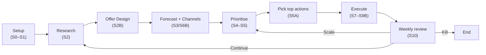

Type: Reference
Status: Active

## The Loop in 8 steps

Every week you run the same eight steps — gather data, design your offer, forecast, prioritise, act, then review — so the business gets sharper each time round.

Each week the S10 review gives you one of three verdicts: Continue (loop back to Research and sharpen your data), Scale (jump straight to Prioritise with what you already know), or Kill (end the business and move on). The loop is designed to be fast — most businesses complete the full first pass in 2–4 weeks.
